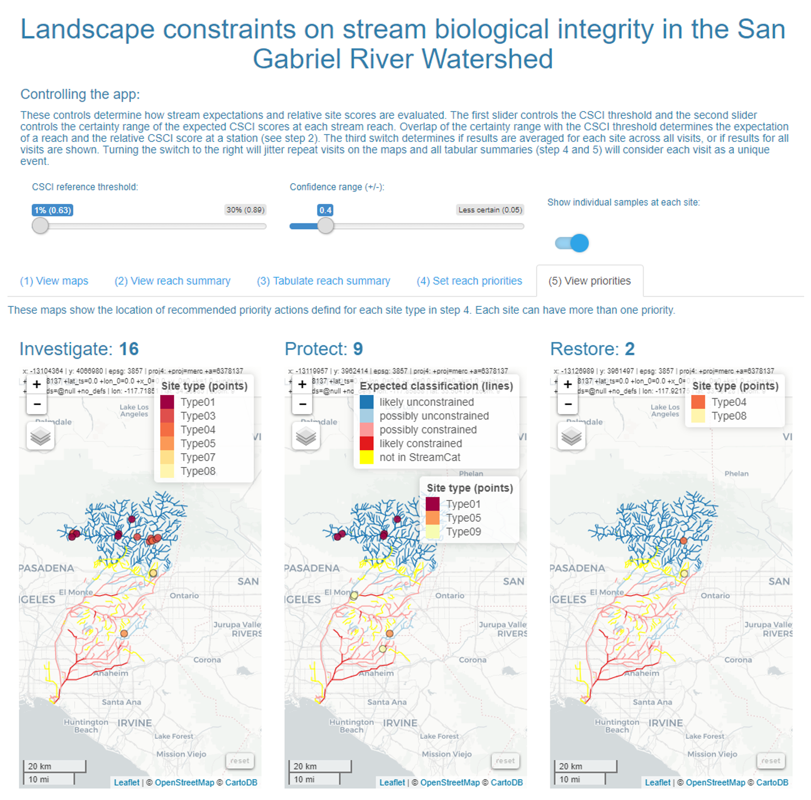
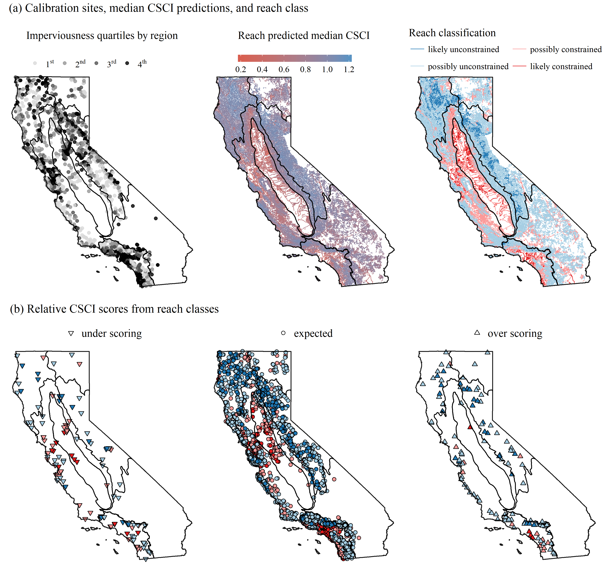

```{r setup, echo = F, warning = F, message = F, results = 'hide'}
# figure path, chunk options
knitr::opts_chunk$set(fig.path = 'figs/', warning = F, message = F, echo = F, cache = T, dev.args = list(family = 'serif'), dpi = 300, warning = F, out.width = '100%',
  fig.process = function(x) {
  x2 = sub('-\\d+([.][a-z]+)$', '\\1', x)
  if (file.rename(x, x2)) x2 else x
  })

# libraries
library(tidyverse)
library(Hmisc)
library(Jabbrev)
library(gridExtra)
library(sf)
library(maptools)
library(maps)
library(grid)
library(ggrepel)
library(RColorBrewer)
library(ggridges)
library(scales)
library(quantregForest)
library(leaflet)
library(raster)
library(flextable)
library(officer)

# functions (incl. color palettes)
source('../R/funcs.R')

# extract bib entries from online
# bib_scrp('manu_draft.Rmd', 'refs.bib')

 # data
load(file = '../data/typetab.RData')
load(file = '../data/csci_raw.RData')
load(file = '../data/ludat.RData')
load(file = '../data/calipsa.RData')
load(file = '../data/psalab.RData')
load(file = '../data/rf_full.RData')
load(file = '../data/sgrlu.RData')
load(file = '../data/shed.RData')
load(file = '../data/spat.RData')
load(file = '../data/scrs.RData')
load(file = '../data/csci_comid.RData')
load(file = '../data/nhdplo.RData')
load(file = '../data/caliclsplo.RData')
load(file = '../data/calicls.RData')
load(file = '../data/caliexp.RData')
load(file = '../data/comid_prd.RData')
load(file = '../data/strclslen.RData')
load(file = '../data/cnstrfrst.RData')
load(file = '../data/sensres.RData')
load(file = '../data/typscrs.RData')
```

# Abstract 

Many streams are failing to achieve desired biological condition and require management decisions to restore designated uses.  Some management goals may be impractical with limited resources, particularly in streams where large-scale changes on the landscape (e.g., urbanization) impose constraints on the upper limit of biological integrity.  A statewide landscape model was developed that sets reasonable expectations for observed conditions within landscape constraints to prioritize management actions. The model provides a context for what is likely to be achieved at a given site independent of an actual bioassessment score.  With this approach, sites can be ranked as over- or under-scoring relative to an expectation that is typical for the observed level of landscape alteration. We developed a visualization tool to compare observed bioassessment scores with modelled expectations to rapidly identify reaches that were scoring better or worse than expected. Using this tool, a group of regulators, dischargers, stormwater agencies, and environmental advocates from the San Gabriel River watershed (Los Angeles County, California) identified regions in the watershed with consistent patterns in bioassessment scores relative to expectations. Based on these patterns, they prioritized different management actions for each region. Sites in both developed and undeveloped areas that scored below expectations were prioritized for restoration; in contrast, restoration was not a priority at developed sites where scores were low but within expected ranges. Sites scoring better than expected were prioritized for enhanced protection, as well as additional monitoring. Interactive tools that connect landscape models with observed data can help set management goals appropriate for stakeholder needs and likely constraints on biological integrity.  These tools can easily be applied to other locations where biological data are used to assess environmental condition.

# Introduction

* Degraded biological condition in streams can occur from individual or multiple stressors acting at different scales [@Novotny05;@Townsend08;@Leps15].

*	In many urban and agricultural areas the majority of stream miles are not healthy and in need of some level of management (cite SWAMP, SMC, NRSA)

* Unfortunately, there are not sufficient resources to restore all streams to reference conditions, nor is it practical (e.g., varying costs and challenges of urban stream restoration [@Kenney12;@Shoredits13])

* Need a way to comprehensively evaluate streams across large spatial scales for “management potential”.  Biological filters act at different scales [@Poff97] and we can use this information to describe an expectation for prioritization that is scale-specific. This allows establishment of reasonable expectations and prioritization of limited resources most effectively. Landscape-level constraints are particularly relevant for macroinvertebrate communities in streams [@Sponseller01]

* Once these large spatial scales are understood, sites can be prioritized by local managers to ensure resources are wisely allocated. 
     
* Goal: demonstrate application of a landscape model to classify and prioritize stream monitoring sites using estimated constraints on biological integrity. 
     * Build on knowledge and relationships developed through existing monitoring programs and apply that in a predictive manner across entire landscapes to inform decisions
     * Statewide application of the model -  The model provides an estimate of context for biological condition that provides an expectation of what is likely to be achieved at a given site relative to large-scale drivers of stream health. The model was developed and applied to all stream reaches in California.
     * A case study is used to demonstrate how the model can be used to classify and prioritize by watershed using guidance from a regional stakeholder group. Specific questions that were addressed through the case study. Active stakeholder involvement was critical in applying the landscape models to define a framework for decision-making because priorities varied with management objectives.

# Methods

## Study area and data sources

```{r calimap, fig.height = 4.5, fig.width = 7, fig.cap = 'Urban and agricultural land use (left) and distribution of observed stream CSCI scores (right) in California. Cover of urban and agricultural land use in stream catchments was used to develop landscape models for stream reach expectations of bioassessment scores.  Grey lines are ecoregions in California, CV: Central Valley, CH: Chaparral, DM: Deserts Modoc, NC: North Coast, SN: Sierra Nevada, SC: South Coast.'}

lucol <- c('lightsalmon', 'grey')

# country base
country <- map_data('state')

# state base
calista <- map_data('state', region = 'california')

# psa data fortified
psadat <- calipsa %>% 
  as('Spatial') %>%
  as.data.frame %>% 
  rownames_to_column('id') %>% 
  dplyr::select(id, PSA6) %>% 
  rename(PSA = PSA6) %>% 
  mutate(Region = factor(PSA, 
    levels = c('Central Valley', 'Chaparral', 'Deserts Modoc', 'North Coast', 'Sierra Nevada', 'South Coast'),
    labels = c('CV', 'Ch', 'DM', 'NC', 'SN', 'SC')
    ))
psafrt <- calipsa %>% 
  dplyr::select(-PSA_REGION, -AREA, -PERIMETER, -PSA8) %>% 
  as('Spatial') %>% 
  fortify %>% 
  left_join(psadat, by = 'id')

# psalab
psalab <- psalab %>% 
  mutate(
    Region = as.character(Region),
    Region = paste0('bolditalic(', Region, ')')
    )

# land use data fortified  
toplo <- ludat %>% 
  as('Spatial') %>% 
  fortify %>% 
  filter(id %in% c(2, 3)) %>% 
  mutate(id = factor(id, levels = c(2, 3), labels = c('Agriculture', 'Urban'))) %>% 
  rename(`Land use` = id)

# csci seq for color pal
palseq <- range(csci_raw$CSCI, na.rm = T) 
palseq <- seq(palseq[1], palseq[2], length = 5)

p1 <- ggplot() + 
  geom_polygon(data = toplo, aes(x = long, y = lat, fill = `Land use`, group = group)) + 
  geom_polygon(data = psafrt, aes(x = long, y = lat, group = group), fill = NA, colour = scales::alpha('black', 0.7), size = 0.1) +
  geom_polygon(data = calista, aes(x = long, y = lat, group = group), fill = NA, colour = scales::alpha('black', 0.7))

# text with outline magic
theta <- seq(pi/8, 2*pi, length.out=16)
xo <- diff(range(psalab$long))/200
yo <- diff(range(psalab$lat))/200
for(i in theta) {
  p1 <- p1 + geom_text_repel(data = psalab, 
    aes_q(x = bquote(long +.(cos(i)*xo)),
          y = bquote(lat +.(sin(i)*yo)),
          label = ~Region), point.padding = NA, parse = T, family = 'serif', size = 5, colour = 'black')
    
}
p1 <- p1 + 
  geom_text_repel(data = psalab, aes(x = long, y = lat, label = Region), point.padding = NA, parse = T, family = 'serif', size = 5, colour = 'white') + 
  coord_map() + 
  scale_fill_manual(values = lucol) +
  theme_void(base_family = 'serif') + 
  theme(
    legend.position = 'top'
    ) + 
  guides(fill = guide_legend(ncol = 3)) +
  ggsn::scalebar(location = 'bottomleft', y.min = 33, y.max = 35, x.min = -124, x.max = -120, 
           dist = 150, st.dist=.15, st.size = 3, height = 0.1, dd2km = T, model = 'WGS84')

p2 <- ggplot(csci_raw, aes(x = Longitude, y = Latitude, colour = CSCI)) +
  scale_colour_gradientn(colours = pal(palseq)) +
  geom_point(size = 1.25) +
  geom_polygon(data = psafrt, aes(x = long, y = lat, group = group), fill = NA, size = 0.1, colour = scales::alpha('black', 0.5)) +
  geom_polygon(data = calista, aes(x = long, y = lat, group = group), fill = NA, colour = scales::alpha('black', 0.5)) +
  coord_map() + 
  theme_void(base_family = 'serif') + 
  theme(legend.position = 'top') + 
  guides(colour = guide_colourbar(barheight = 0.5, barwidth = 8))

pinset <- ggplot(country, aes(x = long, y = lat, group = group)) +
  geom_polygon( fill = NA, color = "black", size = 0.3) +
  geom_polygon(data = calista, fill = 'black', color = "black", size = 0.3)+
  coord_map() +
  theme_void() 
  
grid.newpage()
v1 <- viewport(width = 1, height = 1, x = 0.3, y = 0.5) 
v2 <- viewport(width = 1, height = 1, x = 0.7, y = 0.5) 
v3 <- viewport(width = 0.25, height = 0.25, x = 0.85, y = 0.65)
print(p1, vp = v1) 
print(p2, vp = v2)
print(pinset, vp = v3)
```

Landscape models were developed for California using land use data, stream hydrography, and biological assessments.  California covers 424,000 km$^2$ of land from latitudes 33 to 42$^\circ$N that includes extreme variation in altitude and climate (\@ref(fig:calimap)).  Temperate rainforests occur in the north, deserts in the northeast and southeast, and Mediterranean climates in coastal regions.  California's stream network is approximately 280,000 km in length and covers all of the major climate zones in the state. A high degree of endemism and biodiversity occurs in these streams including nearly 4000 species of vascular plants, macroinvertebrates, and vertebrates that depend on fresh water during their life history [@Howard09;@Howard15].  Approximately 30% of streams in California are perennial with the remaining as intermittent or ephemeral for portions of the year.  Much of California is publicly owned and is used heavily for recreation.  A large portion of the central region of the state is agricultural (i.e., Central Valley), whereas dense areas of urban development are in the southwest (i.e., Los Angeles and San Diego) and central (San Francisco Bay area) coast areas.  Developed lands increased in California by 38% from 1973 to 2000 [@Sleeter11].

Stream data from the National Hydrography Dataset (NHD) [@USGS14] were used to identify reaches in California for modelling biological integrity. The NHD is a surface water framework that maps drainage networks and associated features (e.g., streams, lakes, canals, etc.) in the United States.  Stream flow lines in the NHD are developed from flow accumulation models that estimate location of a stream given slope and elevation changes from existing elevation datasets.  As such, flow lines in California represent both perennial, intermittent, and ephemeral streams that have wide variation in observed flow throughout the year. Stream reaches designated in the NHD were used as the discrete spatial unit for modelling biological integrity.  A reach is defined as a continuous piece of surface water with similar hydrologic characteristics [@USGS14].  Hydrography data were combined with landscape metrics available from the StreamCat Dataset [@Hill16] to estimate land use at the catchment (nearby landscape flowing directly into a stream) and the entire upstream watershed for each reach.  The StreamCat Dataset was developed specifically for the NHD to leverage the topology of stream connections to estimate cumulative landscape metrics of all reaches.

The California Stream Condition Index (CSCI) [@Ode16;@Mazor16] was used as a measure of biological condition in California streams.  Benthic macroinvertebrate data used to calculate CSCI scores were collected at nearly 3400 sites (6270 with repeat visits) between 2000 and 2016.  Field data were collected during baseflow conditions typically between May and July following methods in @Ode07.  The CSCI is a predictive index of stream health that compares the observed taxa and metrics at a site to those expected under reference conditions.  Expected conditions at a site are based on models that estimate the likely macroinvertebrate community in relation to factors that naturally influence biology, e.g., watershed size, elevation, climate, etc.  The CSCI score at a site is based on an observed-to-expected ratio of taxa and a predictive multimetric index composed of six individual metrics that describe the structure and function of the macroinvertebrate community.  The index score at a site can vary from 0 to 1.4, with higher values indicating an observed community with less deviation from reference conditions.  Because the index was developed to minimize the influence of natural gradients, the index scores have consistent meaning across the state [@Reynoldson97].  A threshold score based on a selected lower percentile of scores (e.g., 10%) at all reference sites is used to define nominally low and high scoring sites.

## Building and validating landscape models

A prediction model of the CSCI was developed to estimate likely ranges of scores associated with land use gradients.  Land use as urban and agricultural was quantified for the catchment of each stream reach in California using the StreamCat database [@Hill16]. CSCI scores were modelled using only the estimates of urban and agricultural land use as the developed portion of the landscape within each stream reach. The model was incomplete by design to describe scores only in relation to large-scale constraints on biological condition that are not easily controlled by management actions or where costs to mitigate are likely to be excessive.  The remainder of the variation in scores not related to landscape constraints could be attributed to additional, unmeasured environmental variables that influence stream biointegrity.  Deviation of observed scores from the model predictions were considered diagnostic of variation not related to landscape effects.     

Models were developed using quantile regression forests to estimate ranges of likely CSCI scores in different landscapes [@Meinshausen06;@Meinshausen17].  Quantile models evaluate the conditional response across the range of values that are expected, such as the lower and upper percentiles of the distribution, as compared to only the mean response with conventional models [@Cade03].  This allows use of model predictions to describe where bioassessment targets are unlikely to be met or where streams are unlikely to be impacted by placing bounds on the range of expectations relative to landscape constraints. Random forest models also provide robust predictions by evaluating different subsets of observations from random splits of the predictor variables.  The final predictions are the averaged response across several models.  These models have been used extensively in bioassessment applications [@Carlisle09;@Chen14;@Mazor16] and can produce unbiased estimates that are relatively invariant to noisy relationships or non-normal distributions [@Breiman01;@Hastie09].  Quantile regression forests were used to predict CSCI scores in each stream reach from the 5th to the 95th percentile of expectations at five percent intervals (i.e., 5th, 10th, etc.). 

Calibration data for the landscape models were based on a random selection of 75% of monitoring stations with observed CSCI scores.  The random selection was stratified by ecoregion (Figure \@ref(fig:calimap)) and relative amounts of impervious surfaces in each catchment based on percentile distributions.  The stratification method was chosen to ensure sufficient representation of landscape gradients in each ecoregion.  The remaining sites were used for model validation.  Model performance was assessed for the statewide dataset and within each major region.  Differences between observed CSCI scores and median predictions were evaluated using correlation analysis and root mean squared errors (RMSE).  Regression analysis between predicted and observed scores was used to assess potential bias based on intercept and slope values differing from 0 and 1, respectively.

## San Gabriel River watershed case study

Stream reach and bioassessment data from the San Gabriel River (SGR) watershed in southern California were used to develop reach classifications, site performance categories, and management priorities from the landscape models. A strong land use gradient occurs in the SGR watershed (Figure \@ref(fig:sgrshd)). Headwaters begin in the San Gabriel mountains where the land is primarily undeveloped or protected for reacreational use, whereas the lower watershed is in a heavily urbanized region of Los Angeles County.  The San Gabriel river is dammed at four locations for flood control in the upper watershed and is hydrologically connected to the Los Angeles river to the west through the Whittier Reservoir in the lower watershed. Spreading grounds are present in the middle of the watershed for groundwater recharge during high flow.  Nearly all of the stream reaches in the lower half of the watershed are channelized with concrete or other reinforcements.

```{r sgrshd, fig.height = 8, fig.width = 5.5, fig.cap = 'San Gabriel River watershed in southern California. Land cover is shown in plot (a) and the predicted median CSCI scores at each stream reach and observed CSCI scores are shown in (b). The watershed is undeveloped in the north and heavily urbanized in the south. Ecoregions in the inset are identified in Figure \\@ref(fig:calimap).'}

# land use raster data
luplo <- sgrlu %>% 
  rasterToPoints %>% 
  data.frame %>% 
  rename(`Land cover` = layer) %>% 
  mutate(`Land cover` = factor(`Land cover`, levels = c(5, 4, 3, 2, 1), labels = c('Urban: hi', 'Urban: md', 'Urban: lo', 'Open: forest', 'Open: chaparral'))) 

# hydrolines
spatdat <- spat %>% 
  dplyr::select(COMID, full0.50) %>% 
  mutate(id = as.character(1:nrow(.)))
st_geometry(spatdat) <- NULL
spatfrt <- spat %>% 
  as('Spatial') %>% 
  fortify %>% 
  left_join(spatdat, by = 'id') %>% 
  mutate(COMID = as.character(COMID)) %>% 
  left_join(scrs, by = 'COMID') %>% 
  mutate(csci_diff = csci - full0.50) %>% 
  filter(!is.na(full0.50))

# wshed boundary fortified
shedfrt <- shed %>% 
  as('Spatial') %>% 
  fortify 

# land use colors
lucol <- c('grey20', 'grey40', 'grey60', 'khaki3', 'khaki2')

# psa data fortified
psadat <- calipsa %>% 
  as('Spatial') %>% 
  as.data.frame %>% 
  rownames_to_column('id') %>% 
  dplyr::select(id, PSA6) %>% 
  rename(PSA = PSA6) %>% 
  mutate(Region = factor(PSA, 
    levels = c('Central Valley', 'Chaparral', 'Deserts Modoc', 'North Coast', 'Sierra Nevada', 'South Coast'),
    labels = c('CV', 'Ch', 'DM', 'NC', 'SN', 'SC')
    ))
psafrt <- calipsa %>% 
  dplyr::select(-PSA_REGION, -AREA, -PERIMETER, -PSA8) %>% 
  as('Spatial') %>% 
  fortify %>% 
  left_join(psadat, by = 'id')

palseq <- seq(palseq[1], palseq[2], length = 5)

# pinset
pinset <- ggplot() + 
  geom_polygon(data = psafrt, aes(x = long, y = lat, group = group), fill = NA, colour = scales::alpha('black', 0.5), size = 0.2) +
  geom_polygon(data = shedfrt, aes(x = long, y = lat, group = group), fill = 'tomato1') +
  theme_minimal() + 
  theme(
    panel.grid.minor = element_blank(), 
    panel.grid.major = element_blank(), 
    axis.text = element_blank(), 
    axis.title = element_blank()
    ) + 
  coord_map()

# csci seq for color pal
seqcsc <- range(spatfrt$csci, na.rm = T) 
seqcsc <- seq(seqcsc[1], seqcsc[2], length = 5)

# color legend
colleg <- ggplot() +
  geom_point(data = spatfrt, aes(x = long.y, y = lat.y, colour = csci)) +
  theme_bw(base_family = 'serif') +
  theme(
    legend.position = 'top',
    legend.justification = 'left',
    legend.box.just = 'left',
    legend.box = 'vertical'
  ) +
  scale_colour_gradientn('CSCI', colours = pal(seqcsc)) +
  guides(colour = guide_colourbar('CSCI', barheight = 0.55, barwidth = 8, title.position = 'top'))
colleg <- g_legend(colleg)

# separate lu legend
luleg <- ggplot(luplo) + 
  geom_tile(aes(x, y, fill = `Land cover`), alpha=0.8) +
  theme_bw(base_family = 'serif') +
  theme(
    legend.position = 'top', 
    legend.justification = 'left',
    legend.box.just = 'left',
    legend.box = 'vertical'
  ) +  
  scale_fill_manual('Land cover', values = lucol) +
  guides(fill = guide_legend(ncol = 2, title.position = 'top'))
luleg <- g_legend(luleg)
  
# land use plot
p1 <- ggplot(luplo) + 
  geom_tile(aes(x, y, fill = `Land cover`), alpha=0.8) +
  theme_void(base_family = 'serif') +
  scale_fill_manual('Land cover', values = lucol) +
  geom_polygon(data = shedfrt, aes(x = long, y = lat, group = group), fill = NA, colour = 'black', alpha = 0.7) +
  coord_equal() +
  theme_void(base_family = 'serif') +
  theme(
    legend.position = 'none', 
    axis.title = element_blank()
    ) +
  ggtitle('(a) Land cover in the San Gabriel watershed')

# hydrolines plot with CSCI pts
p2 <- ggplot() +
  geom_polygon(data = shedfrt, aes(x = long, y = lat, group = group), fill = 'white', colour = 'black', alpha = 0.7) +
  geom_path(data = spatfrt, aes(x = long.x, y = lat.x, group = id, colour = full0.50, linetype = 'Reach predicted\nmedian CSCI')) +
  scale_colour_gradientn(colours = pal(seqcsc)) +
  geom_point(data = spatfrt, aes(x = long.y, y = lat.y, fill = csci, shape = 'Observed CSCI'), size = 3, alpha = 0.9) +
  scale_fill_gradientn('', colours = pal(seqcsc)) +
  scale_linetype_manual('', values = 'solid') +
  scale_shape_manual('', values = 21) +
  ggsn::scalebar(location = 'bottomright', y.min = 33.77, y.max = 33.8, x.min = -118, x.max = -117.7, dist = 10, st.dist=.5, st.size = 3, height = 0.3, dd2km = T, model = 'WGS84') +
  guides(fill = F, colour = F) +
  coord_equal() +
  theme_void(base_family = 'serif') +
  theme(
    # legend.position = 'top',
    legend.justification = 'left',
    legend.box.just = 'left',
    axis.title = element_blank()
    ) + 
  ggtitle('(b) Reach median predictions and observed scores for the CSCI')
p2leg <- g_legend(p2) 
p2 <- p2 + theme(legend.position = 'none')

# png('figs/sgrshd.png', height = 8, width = 5.5, units = 'in', res = 300, family = 'serif')
grid.arrange(
  arrangeGrob(p1, 
              arrangeGrob(pinset, luleg, ncol = 1, heights = c(1, 1)), ncol = 2, widths = c(1, 0.5)),
  arrangeGrob(p2, 
              arrangeGrob(colleg, p2leg, ncol = 1, heights = c(1,1)), ncol = 2, widths = c(1, 0.5)), 
  ncol = 1
)
# dev.off()
```

The SGR watershed contains a diverse group of stakeholders from local municipalities, water districts, water quality regulatory agencies, consulting groups, and non-government organizations. Collectively, the San Gabriel River Regional Monitoring Program (SGRRMP) includes stakeholders from these groups that cooperatively work to increase awareness of issues in the SGR watershed and work to improve coordination of compliance and ambient monitoring efforts.  The stakeholder workgroup included individuals from the SGRRMP with interests in water supply, improvements to water quality, habitat protection or creation, and storm water permitting. Individuals were selected for partipation to include a variety of mangement interests and based on willingness to adopt tools developed from the landscape models. The stakeholder workgroup met monthly over a six-month period to discuss model applications and to refine the interpretation of results.  Stakeholder involement was critical for developing an assessment framework that met the needs of all engaged parties and ensured that final products were more likely to be incorporated into formal processes of decision-making. 

## Reach classification, site performance, and prioritization

A framework for identifying site priorities for management actions was developed using a three-step process.  First, estimates of the range of expected CSCI scores at each stream reach in relation to land use were used to define reach classifications.  Second, the relationship between observed CSCI scores and the reach classifications were then used to assign a relative performance value for each monitoring site. Third, site performance categories in relation to reach classification and bioassessment targets were used to define management priorities.  This framework was developed through close interaction with the regional stakeholder group to demonstrate how the landscape model can be used as a management tool given that priorities will vary by interests and location.  As such, the results are provided as a guide to facilitate decision-making rather than a prescription of targeted actions to manage stream health.  The entire process is shown in Figure \@ref(fig:ridges) and Table \@ref(tab:typetab) and is described in detail below.. 

Identifying site priorities began with defining a classification framework for stream reaches to identify the possible or likely extent of biological constraints.  Classifications were developed using the range of CSCI expectations at a reach (Figure \@ref(fig:ridges)a,b) relative to a chosen threshold for the CSCI to define nominally low or high scores (Figure \@ref(fig:ridges)c).  The reach classification was based solely on the intersection of the CSCI expectations at a reach with chosen CSCI threshold, where expectations could be below, above, or overlapping the threshold.  Stream reaches with a range of CSCI score expectations entirely below the thresholds were considered likely constrained, whereas those with expectations entirely above were considered likely unconstrained.  Reaches with score expectations that included the CSCI thresholds were considered possibly constrained or possibly unconstrained, where the distinction was based on location of the median expectation of a reach relative to the threshold.  

```{r ridges, fig.height = 8, fig.width = 10, fig.cap = 'Application of landscape models to identify site expectations and bioassessment performance for sixteen example stream reaches.  A range of CSCI scores is predicted from the model (a) and the lower and upper limits of the expectations are cut to define a certainty range for the predictions (b).  Overlap of the certainty range at each reach with a chosen CSCI threshold (c) defines the stream reach classification as likely unconstrained (lu), possibly unconstrained (pu), possibly constrained (pc), and likely constrained (lc).  The site performance from the observed bioassessment score is defined as over scoring (above the certainty threshold), expected (within), and under scoring (below) for each of four stream classes (d).'}
##
# plot data

# plot data globals
sel <- 16
bnd <- 0.1
pts <- 2000
qts <- 0.05
thrsh <- 0.79

catcds <- data.frame(
  int = c('111', '011', '001', '000'),
  cls = c('likely unconstrained', 'possibly unconstrained', 'possibly constrained', 'likely constrained'),
  clsabv = c('lu', 'pu', 'pc', 'lc')
)

prfcds <- data.frame(
  int = c('00', '01', '11'), 
  cls = c('over scoring', 'expected', 'under scoring')
)

prflev <- c('over scoring', 'expected', 'under scoring')

scrshyp <- c(1.35, 1.15, 0.84, 0.6, 1.25, 0.95, 0.75, 0.53, 1.1, 0.83, 0.53, 0.35, 1, 0.75, 0.45, 0.15)

# plot data
set.seed(433)
rnd <- data.frame(
  id = factor(rev(1:sel), levels = rev(1:sel)),
  ave = rep(seq(0.5, 1.1, length = 4), each = 4),
  sds = sample(c(0.13), sel, replace = T), 
  scrshyp = rev(scrshyp)
  ) %>%
  group_by(id, scrshyp) %>% 
  nest %>%
  mutate(
    rnd = purrr::map(data, ~ rnorm(pts, .x$ave, .x$sds)), 
    estall = purrr::map(rnd, function(x){
      
      est <- density(x, n = pts, bw = bnd)
      out <- data.frame(
        xout = est$x, 
        hght = est$y
      )
      
      return(out)
      
    }), 
    estcut = purrr::pmap(list(rnd, estall), function(rnd, estall){
      
      qts <- quantile(rnd, c(qts, 1 - qts))
      out <- estall %>% 
        filter(xout >= qts[1] & xout <= qts[2])
      
      return(out)
      
    }), 
    estcat = purrr::map(estcut, function(x){
      
      out <- c(range(x$xout), median(x$xout)) %>% 
        sort %>% 
        findInterval(., thrsh) %>% 
        paste(collapse = '') %>% 
        factor(levels = catcds$int, labels = catcds$clsabv) %>% 
        as.character
      
      return(out)
      
      
    }), 
    prfcat = purrr::pmap(list(estcut, scrshyp), function(estcut, scrshyp){
      
      out <- range(estcut$xout) %>% 
        findInterval(., scrshyp) %>% 
        paste(collapse = '') %>% 
        factor(levels = prfcds$int, labels = prfcds$cls) %>% 
        as.character
      
      return(out)
      
    })
  )

toplo1 <- rnd %>% 
  dplyr::select(id, estall) %>% 
  unnest

toplo2 <- rnd %>% 
  dplyr::select(id, estcut) %>% 
  unnest

toplo3 <- rnd %>% 
  dplyr::select(id, estcut, estcat, prfcat) %>% 
  unnest(estcat, prfcat) %>% 
  unnest %>% 
  mutate(
    prfcat = paste0(prfcat, ' (', estcat, ')'), 
    estcat = factor(estcat, levels = catcds$clsabv, labels = catcds$cls)
  ) %>% 
  rename(`Stream class` = estcat)

toplo4 <- rnd %>% 
  dplyr::select(id, scrshyp, estcat, prfcat) %>% 
  unnest %>% 
  mutate(
    prfcat = factor(prfcat, levels = prflev),
    estcat = factor(estcat, levels = catcds$clsabv, labels = catcds$cls),
    hght = scrshyp
  ) %>% 
  rename(
    `Relative site score` = prfcat,
    `Stream class` = estcat
    )

##
# plots

# stream class colors
exp_col <- RColorBrewer::brewer.pal(9, 'Paired')[c(2, 1, 5, 6)] %>% 
  alpha(., 0.8)  

# plot globals
ht <- 0.99

# base 
pbase<- ggplot(toplo1, aes(x = xout, y = id, height = hght)) + 
  geom_density_ridges(stat = 'identity', alpha = 0.5, colour = NA, fill = 'grey', scale = ht) +
  scale_x_continuous(limits = c(0, 1.4)) + 
  theme_minimal(base_family = 'serif') + 
  theme(
    axis.title.x = element_blank(), 
    axis.title.y = element_blank(), 
    legend.position = 'top'
  )

p1 <- pbase +
  geom_density_ridges(stat = 'identity', rel_min_height = 0.001, colour = 'black', fill = 'darkgrey', scale = ht) +
  scale_fill_gradient2(low = '#d7191c', mid = '#abd9e9', high = '#2c7bb6', midpoint = 1) +
  guides(fill = guide_colourbar('CSCI', barheight = 0.5, barwidth = 5, title.position = 'top')) +
  ggtitle('(a) Range of expected CSCI\nscores for stream reaches')

p2 <- pbase +
  geom_density_ridges(data = toplo2, stat = 'identity', rel_min_height = 0.001, colour = 'black', fill = 'darkgrey', scale = ht) +
  scale_fill_gradient2(low = '#d7191c', mid = '#abd9e9', high = '#2c7bb6', midpoint = 1) +
  ggtitle('(b) Expected CSCI scores\nwithin certainty range') +
  theme(legend.position = 'none')

p3 <- pbase +
  geom_density_ridges(data = toplo3, aes(fill = `Stream class`), stat = 'identity', colour = 'black', scale = ht) +
  geom_vline(xintercept = thrsh, linetype = 'dashed') +
  scale_fill_manual(values = exp_col) +
  guides(fill = guide_legend(title.position = 'top', nrow = 2)) +
  ggtitle('(c) Stream reach classification\nby CSCI threshold')

p4 <- pbase +
  geom_density_ridges(data = toplo3, aes(fill = `Stream class`), stat = 'identity', colour = 'black', scale = ht) +
  geom_vline(xintercept = thrsh, linetype = 'dashed') +
  geom_point(data = toplo4, aes(x = scrshyp, group = id, shape = `Relative site score`, fill = `Stream class`), size = 3) + 
  scale_fill_manual(values = exp_col, guide = F) +
  scale_colour_manual('Site performance', values = pal_prf2(levels(toplo4$`Site performance`)), na.value = 'yellow') + 
  scale_shape_manual(values = c(24, 21, 25)) +  
  guides(colour = guide_legend(title.position = 'top'), shape = guide_legend(title.position = 'top')) +
  ggtitle('(d) Site performance by\nstream classification')

p3leg <- g_legend(p3)
p3 <- p3 + theme(legend.position = 'none')

p4leg <- g_legend(p4)
p4 <- p4 + theme(legend.position = 'none')

grid.arrange(
  arrangeGrob(p3leg, p4leg, ncol = 2, widths = c(0.75, 1)),
  arrangeGrob(p1, p2, p3, p4, ncol = 4),
  left = 'Reach type', bottom = 'CSCI scores', ncol = 1, heights = c(0.2, 1)
)
```

CSCI scores from biomonitoring data were used to define performance of a sample site relative to the stream reach classification (Figure \@ref(fig:ridges)d). For each of the four reach classifications (likely constrained, possibly constrained, possibly unconstrained, and likely unconstrained), the site performance was defined relative to the bounds of the expected CSCI scores.  This provided a definition of site performance that can be used to understand the observed score relative to the biological context of a reach.  Sites with observed scores above the upper limit of the reach expectation (e.g., above the 95th percentile of expected scores) were considered "over-performing" and sites below the lower limit were "under-performing".  Sites with CSCI scores within the range of expectations were as "expected".   

Site performance categories were further split relative to location to the selected CSCI threshold.  This final split was created with the intent that description of site scores relative to a defined threshold (e.g., impairment threshold or restoration target) should also be considered.  Specifically, a fourth category of site performance for each reach classifcation was added to define a site as above or below the threshold.  For a likely unconstrained reach, underperforming sites below the minimum expected score were additionally defined as being above or below the CSCI threshold.  Similarly, overperforming sites above the maximum expected score in a likely constrained reach were additionally defined as being below or above the CSCI threshold.  For possibly constrained and possibly unconstrained reaches, sites that were performing as expected were addtionally defined as being below or above the CSCI threshold.  In total, sixteen site types were defined for the three reach classification and three site performance classifications (Table \@ref(tab:typetab)).

```{r typetab, tidy = F}
# table content format
totab <- typetab %>% 
  mutate(
    `Observed score` = gsub('>=', '$\\\\geq$', `Observed score`),
    `Reach expectation` = ifelse(duplicated(`Reach expectation`), '', paste0('**', `Reach expectation`, '**')), 
    Type = as.character(Type)
  ) %>% 
  dplyr::select(-Sites)

# table stuff
cap.val <- 'Possible site types based on stream reach classification, site performance, and observed CSCI score. The observed score column describes where a CSCI score is observed relative to the lower and upper percentiles (e.g., 5th and 95th) of expected scores for a reach and the chosen CSCI threshold (e.g., 10th percentile of scores at reference sites or 0.79) for nominally low or high values.'

# table
knitr::kable(totab, booktabs = T, caption = cap.val)
```

Each site type was used to define a priority as a demonstration of how results from the landscape model can help achieve different stream management objectives.  This final process relied exclusively on feedback from the stakeholder group that represented interests in monitoring, regulation, restoration, and protection.  An interactive online application was created for the stakeholder group to facilitate the recommendation of management actions for each site type (Figure \@ref(fig:app)).  Priorities for each site type were defined accordingly with the expectation that site types will have different meanings for prioritization given the interest.  Stakeholders from each sector were tasked with identifying their relevant priorities by ranking each site type from high to low priority using a blank template for reference.  A brief description of the rationale for a site priority was also requested with the feedback.  The final priorities were generalized into three categories to recommend actions in addition to baseline monitoring and maintenance. The final priorities also assumed that existing information available for each site was "true" following established practices to account for uncertainty or variation between assessments.  A consensus was reached for the following definitions of each action:

* Investigate:  Additional monitoring or review of supplementary data (e.g., aerial imagery);
* Protect: Additional scrutiny of proposed development and/or projects; 
* Restore: Targeted action for causal assessment and/or restoration funds.

Each site type was ranked as high, medium, or low priority for each action.  No priority assigned to an action for a stream type was indication that baseline monitoring and maintenance was sufficient for a site type.

```{r app, fig.cap='Screenshot of the online application used by the stakeholder group to interact with and use results from the landscape models.  The application allowed users to visualize results of reach classications, relative site scores for the CSCI based on the expectation, and recommend management actions for each reach type.  The app can be viewed at https://beckmw.shinyapps.io/sgrrmp_classify/'}

```

## Sensitivity analyses

Factors explaining variation between constrained and unconstrained stream reaches were evaluated for the major regions in California (Figure \@ref(fig:calimap)). Landscape and geological data in StreamCat at the riparian and watershed scale were used to model variation between reach classes using random forest models [@Breiman01]. For each region, 1000 regression trees were created and the mean reduction in accuracy was estimated for the exclusion of each variable across all models. This created an estimate of importance of each variable for describing differences betwen stream classes. Mean reduction in accuracy was estimated for variables in each model and separately for each stream class in each model.  Reach classes as possibly or likely constrained (or unconstrained) were combined to evaluate differences between only two classes.

Stream reach classifications and site performance categories depend on the range of score expectations from the landscape model (or certainty, Figure  \@ref(fig:ridges)b) and the CSCI threshold for defining nominally low or high scores (Figure \@ref(fig:ridges)c).  This framework for identifying priorities was developed to allow flexibility in how the model could be applied.  First, the framework can accommodate degrees of certainty in the model by allowing variation in the range of scores that are used to define a stream reach classification.  The 5th and 95th percentile of expected scores at a reach are used as a default range in which a high degree of certainty in the model output is assumed.  The ability to reduce this range (e.g., 25th to 75th percentile) to assume less certainty in the model is provided.  The CSCI threshold can also be changed to assess effects of relaxing or increasing flexibility in a potential definition of a regulatory standard. A threshold of 0.79 is used by default as a measure of the 10th percentile of scores at all reference (non-impacted) sites that were used to calibrate the CSCI index. This value can be increased to examine effects of a more stringent threshold or decreased for a more relaxed threshold.  The combined effects of changing both the certainty in the model and the CSCI threshold were evaluated to estimate the changes in stream miles in each classification and the number of sites in each priority type.     

## Unclassified reaches

Finally, some stream reaches were unclassifed following application of the landscape model to the statewide hydrography dataset.  Unclassified reaches occurred when insufficient data in the StreamCat database were available to estimate CSCI predictions or if a stream catchment basin could not be defined for a particular reach.  The latter was more common, particularly in developed areas where engineered channels or agricultural ditches were hydrologically removed from the natural stream network.  Overall, unclassified reaches were not common in the statewide dataset but they may have regional importance depending on needs of local management groups.  A preliminary approach for assigning biological expectations to unclassified reaches is demonstrated for 'typically' urban and agriculture reaches that relies on the range of expectations for reaches with similar land use by region.

# Results

## State-wide patterns

The landscape model was used to predict an expected range of CSCI scores for `r nrow(comid_prd)` stream reaches in California.  The bioassessment dataset used to develop the model included `r sum(csci_comid$SelectedSample %in% 'Selected')` unique field observations assigned to stream reaches in the NHDPlus dataset.  By region, the most bioassessment samples were observed in the South Coast (n = 839), followed by the the Chapparal (n = 684) and Sierra Nevada regions (n = 548).  Model performance statewide and by region indicated generally good agreement between observed CSCI scores and the median prediction for the associated stream reach (Table \@ref(tab:perftab)).  Correlation between observed and predicted values for the entire calibration dataset was $\rho =$ 0.84 and RMSE = 0.14.  The intercept and slope for a regression between observed and predicted values were 0.24 and 0.72, suggesting a slight negative bias of predcitions at lower scores and slight positive bias at higher scores.  The statewide calibration data showed similar results, with slightly smaller correlation ($\rho =$ 0.72) and larger RMSE (0.18) estimates.  

```{r perftab}
# observed and predicted data
obsdat <- csci_comid %>%
  dplyr::select(COMID, StationCode, SiteSet, SelectedSample, CSCI, PSA6c, RegImpQ) %>% 
  filter(SelectedSample %in% 'Selected')
prddat <- comid_prd %>% 
  dplyr::select(COMID, full0.50)

# combined data to eval for perf
dat <- obsdat %>% 
  inner_join(prddat, by = 'COMID') %>% 
  rename(
    observed = CSCI,
    predicted = full0.50
  ) %>% 
  dplyr::select(SiteSet, PSA6c, observed, predicted)

# total dataset performance
totdf <- dat %>% 
  group_by(SiteSet) %>% 
  nest %>% 
  mutate(data = purrr::map(data, function(x){

    nval <- nrow(x)
    aveobs <- mean(x$observed, na.rm = T)
    sdobs <- sd(x$observed, na.rm = T)
    aveprd <- mean(x$predicted, na.rm = T)
    sdprd <- sd(x$predicted, na.rm = T)
    mod <- lm(predicted ~ observed, data = x)
    intv <- coefficients(mod)[1]
    slov <- coefficients(mod)[2]
    corv <- with(x, cor.test(observed, predicted))$estimate
    errv <- with(x, sqrt(mean((predicted - observed)^2, na.rm = T)))
    
    out <- tibble(set = 'Statewide', nval, aveobs, sdobs, aveprd, sdprd, corv, errv, intv, slov)
    return(out)
    
  })) %>% 
  unnest

# PSA regional performance
regdf <- dat %>% 
  group_by(PSA6c, SiteSet) %>% 
  nest %>% 
  mutate(data = purrr::map(data, function(x){
    
    nval <- nrow(x)
    aveobs <- mean(x$observed, na.rm = T)
    sdobs <- sd(x$observed, na.rm = T)
    aveprd <- mean(x$predicted, na.rm = T)
    sdprd <- sd(x$predicted, na.rm = T)
    ttst <- with(x, t.test(observed, predicted, na.rm = T))
    mod <- lm(predicted ~ observed, data = x)
    intv <- coefficients(mod)[1]
    slov <- coefficients(mod)[2]
    corv <- with(x, cor.test(observed, predicted))$estimate
    errv <- with(x, sqrt(mean((predicted - observed)^2, na.rm = T)))
    
    out <- tibble(nval, aveobs, sdobs, aveprd, sdprd, corv, errv, intv, slov)
    return(out)
    
  })) %>% 
  unnest %>% 
  rename(set = PSA6c) %>% 
  dplyr::select(SiteSet, set, everything())

# combine and prep for table
allerr <- totdf %>% 
  bind_rows(regdf) %>% 
  mutate_if(is.numeric, round, 2) %>% 
  mutate(
    sdobs = paste0('(', sdobs, ')'), 
    sdprd = paste0('(', sdprd, ')'), 
    set = factor(set, levels = c('Statewide', 'CH', 'CV', 'DM', 'NC', 'SC', 'SN'))
  ) %>% 
  unite('Observed', aveobs, sdobs, sep = ' ') %>% 
  unite('Predicted', aveprd, sdprd, sep = ' ') %>% 
  rename(
    n = nval,
    Correlation = corv, 
    RMSE = errv, 
    Slope = slov, 
    Intercept = intv,
    Location = set, 
    Dataset = SiteSet
  ) %>% 
  arrange(Dataset, Location) %>% 
  mutate(Dataset = ifelse(duplicated(Dataset), '', Dataset))

# table stuff
cap.val <- 'Performance of landscape models by calibration and validation datasets in predicting CSCI scores.  The statewide dataset (Figure \\@ref(fig:calires)) and individual regions of California (Figure \\@ref(fig:calimap) are evaluated.  Averages and standard deviations (in parentheses) for observed and predicted values of each dataset are shown.  Correlations, root mean squared errors, intercept, and slopes are for comparisons of predicted and observed values to evaluate model performance.'

# table
knitr::kable(allerr, booktabs = T, caption = cap.val)
```

Model performance differed by region. Performance for the Chapparal and South Coast regions were comparable or slightly improved compared to the statewide dataset for both the calibration and validation datasets.  Model predictions for the Central Valley, Desert Modoc, and North Coast regions had slightly lower performance compared to the statewide results, with correlations of approximately 0.75 with observed values in the calibration dataset and 0.55 in the validation dataset.  Model performance was poor for the Sierra Nevada region where the lowest correlation between predicted and observed values was observed. Regression estimates for the validation data in this region showed an intercept and slope of approximately 1 and 0.  Overall, model performance was strongly associated with land use gradients in each region (Figure \@ref(fig:perflu)).  The landscape model peformed well in regions with a mix of urban, agricultural, and open land, such as the South Coast region where strong gradients from open to urban lands occur in many watersheds (top left, Figure \@ref(fig:calires).  Conversely, the model did not perform well in regions where developed landscapes were less common, such as the Sierra Nevada region.  Figure \@ref(fig:perflu) demonstrate a decrease in the model residuals as a function of increasing urban or agricultural land.    

```{r perflu, fig.height =  6, fig.width = 6, fig.cap = "Model performance in relation to land cover and land cover by major regions in California. Model residuals were smaller in regions with more urban or agricultural land use (e.g., SC, CV) and larger in regions with less anthropogenic land use (e.g., SN, DM). CV: Central Valley, CH: Chaparral, DM: Deserts Modoc, NC: North Coast, SN: Sierra Nevada, SC: South Coast."}

# observed and predicted data
obsdat <- csci_comid %>%
  dplyr::select(COMID, StationCode, SiteSet, SelectedSample, CSCI, PSA6c, PctImp2006Ws, TotUrb2011Ws, TotAg2011Ws) %>% 
  filter(SelectedSample %in% 'Selected')
prddat <- comid_prd %>% 
  dplyr::select(COMID, full0.50)

# combined data to eval for perf
dat <- obsdat %>% 
  inner_join(prddat, by = 'COMID') %>% 
  rename(
    observed = CSCI,
    predicted = full0.50, 
    imperv = PctImp2006Ws, 
    ag = TotAg2011Ws,
    urb = TotUrb2011Ws,
    Region = PSA6c
  ) %>% 
  mutate(
    modrsd = predicted - observed
  ) %>%
  gather('var', 'val', urb, ag) %>% 
  mutate(var = factor(var, levels = c('urb', 'ag'), labels = c('Urban', 'Agriculture')))

col <- c('grey', 'lightsalmon')#RColorBrewer::brewer.pal(8, 'Paired')[c(1, 3)]

# residuals by land use
p1 <- ggplot(dat, aes(x = val, y = modrsd, colour = var)) +
  geom_point(size = 1, alpha = 0.7) +
  theme_bw(base_family = 'serif', base_size = 14) +
  facet_wrap(~var, strip.position = 'bottom', ncol = 2) +
  geom_hline(yintercept = 0) + 
  theme(
    strip.background = element_blank(), 
    strip.placement = 'outside', 
    axis.title.x = element_blank(), 
    legend.position = 'none'
  ) + 
  scale_y_continuous('CSCI predicted - observed', limits = c(-0.65, 0.65)) + 
  scale_colour_manual(values = col)

# land use by region
meds <- dat %>% 
  spread(var, val) %>% 
  group_by(Region) %>% 
  summarise(urbmed = median(log10(Urban), na.rm = T)) %>% 
  arrange(urbmed)

toplo <- dat %>% 
  mutate(Region = factor(Region, levels = meds$Region))
p2 <- ggplot(toplo, aes(x = Region, y = val, fill = var)) + 
  geom_boxplot() +
  scale_fill_manual(values = col) +
  scale_y_log10('% land cover, log10',
                breaks = scales::trans_breaks("log10", function(x) 10^x),
                labels = scales::trans_format("log10", scales::math_format(10^.x))
  ) +
  theme_bw(base_family = 'serif', base_size = 12) +
  theme(
    legend.position = 'top', 
    legend.title = element_blank(),
    axis.title.x = element_blank()
  )

grid.arrange(p1, p2, ncol = 1, heights = c(0.9, 1))
```

Statewide patterns in stream constraints were apparent from the results of the landscape models consistent with land use (Figure \@ref(fig:calires)).  Stream reaches were more often constrained for biotic integrity in regions with more watershed development, either as urban or agricultural land.  For example, likely constrained reaches are apparent from the statewide map in coastal reaches of the South Coast where heavy urbanization occurs and in the Central Valley where agriculure is the dominant land use.  Stream reaches were more likely to be unconstrained in regions with less developemtn occurred, with areas in the North Coast and the Sierra Nevada region visible on the map (top right, Figure \@ref(fig:calires)).  A majority of reaches statewide were classified as possibly constrained (23% of all stream length) or possibly unconstrained (67%), whereas a minority were likely constrained (3%) or likely unconstrained (7%) (Table \@ref(tab:reltot)).  By region, the most reaches classified as likely unconstrained reaches were in the North Coast (20%) and Sierra Nevada regions (19%) and the most reaches as likely constrained were observed in the Central Valley (25%) and South Coast (9%) regions.  Relative CSCI scores compared to reach expectations were as expected for 92% of the sampled locations statewide, with an equal amount of sites under or over scoring (bottom Figure \@ref(fig:calires), Table \@ref(tab:reltot)).  Similar patterns were observed within regions, although a slightly larger percentage of sites in the Central Valley were under scoring compared to the other regions.  

```{r eval = F}
# state base
calista <- map_data('state', region = 'california')

# psa data fortified
psadat <- calipsa %>%
  as('Spatial') %>%
  as.data.frame %>%
  rownames_to_column('id') %>%
  dplyr::select(id, PSA6) %>%
  rename(PSA = PSA6) %>%
  mutate(Region = factor(PSA,
                         levels = c('Central Valley', 'Chaparral', 'Deserts Modoc', 'North Coast', 'Sierra Nevada', 'South Coast'),
                         labels = c('CV', 'Ch', 'DM', 'NC', 'SN', 'SC')
  ))
psafrt <- calipsa %>%
  dplyr::select(-PSA_REGION, -AREA, -PERIMETER, -PSA8) %>%
  as('Spatial') %>%
  fortify %>%
  left_join(psadat, by = 'id')

# station calibration data
caldat <- csci_comid %>%
  dplyr::select(COMID, StationCode, SiteSet, SelectedSample, CSCI, RegImpQ)
locs <- csci_raw %>%
  dplyr::select(MasterID, Latitude, Longitude) %>%
  rename(StationCode = MasterID) %>%
  unique
caldat <- caldat %>%
  left_join(locs, by = 'StationCode') %>%
  filter(SelectedSample != 'NotSelected') %>%
  filter(!is.na(Latitude)) %>%
  filter(SiteSet %in% 'Cal') %>%
  mutate(RegImpQ = factor(RegImpQ, levels = c('T1', 'T2', 'T3', 'T4'), labels = c('1^st', '2^nd', '3^rd', '4^th')))

# all comid preds
calmed <- nhdplo %>%
  na.omit

# impervious quartile colors
impcol <- RColorBrewer::brewer.pal(9, 'Greys')[c(3, 5, 7, 9)]

# csci seq for color pal
palseq <- range(csci_raw$CSCI, na.rm = T)
palseq <- seq(palseq[1], palseq[2], length = 5)

# relative site scores
relscr <- caliexp %>%
  dplyr::select(lat, long, perf, strcls) %>%
  filter(!is.na(perf))

# calibration sites with impervious
p1 <- ggplot(caldat, aes(x = Longitude, y = Latitude, colour = RegImpQ)) +
  scale_colour_manual(values = impcol, labels = parse(text = levels(caldat$RegImpQ))) +
  geom_point(size = 1.25, alpha = 0.8) +
  geom_polygon(data = psafrt, aes(x = long, y = lat, group = group), fill = NA, size = 0.5, colour = scales::alpha('black', 0.9)) +
  coord_map() +
  guides(colour = guide_legend("Imperviousness quartiles by region\n", title.position = 'top')) +
  theme_void(base_family = 'serif') +
  theme(
    legend.position = c(0.5, 1.06),
    legend.direction = 'horizontal',
    plot.margin = grid::unit(c(15, 0, 0, 0), units = 'pt')
  )

# median csci predictions
p2 <- ggplot(calmed) +
  geom_path(aes(x = long, y = lat, group = id, colour = full0.50), size = 0.30) +
  geom_polygon(data = psafrt, aes(x = long, y = lat, group = group), fill = NA, size = 0.5, colour = scales::alpha('black', 0.9)) +
  coord_map() +
  scale_colour_gradientn(colours = pal(range(calmed$full0.50, na.rm = T))) +
  guides(colour = guide_colourbar('Reach predicted median CSCI\n', barheight = 0.5, barwidth = 8, title.position = 'top')) +
  theme_void(base_family = 'serif') +
  theme(
    legend.position = c(0.5, 1.06),
    legend.direction = 'horizontal',
    plot.margin = grid::unit(c(15, 0, 0, 0), units = 'pt')
  )

# comid class
p3 <- ggplot(caliclsplo) +
  geom_path(aes(x = long, y = lat, group = id, colour = strcls), size = 0.30) +
  geom_polygon(data = psafrt, aes(x = long, y = lat, group = group), fill = NA, size = 0.5, colour = scales::alpha('black', 0.9)) +
  coord_map() +
  scale_colour_manual(values = pal_exp(levels(caliclsplo$strcls))) +
  guides(colour = guide_legend('Reach classification', title.position = 'top', ncol = 2)) +
  theme_void(base_family = 'serif') +
  theme(
    legend.position = c(0.5, 1.06),
    legend.direction = 'horizontal',
    plot.margin = grid::unit(c(15, 0, 0, 0), units = 'pt')
    )

# relative site scores
undscr <- relscr %>% 
  filter(perf %in% 'under scoring')
p4<- ggplot(undscr) +
  geom_point(aes(x = long, y = lat, fill = strcls, shape = perf)) +
  geom_polygon(data = psafrt, aes(x = long, y = lat, group = group), fill = NA, size = 0.5, colour = scales::alpha('black', 0.9)) +
  coord_map() + 
  scale_fill_manual(values = pal_exp(levels(caliexp$strcls)), guide = F) +
  scale_shape_manual(values = c(25)) +
  theme_void(base_family = 'serif', base_size = 14) + 
  theme(
    legend.position = c(0.5, 1.04), 
    plot.margin = grid::unit(c(7, 0, 0, 0), units = 'pt'),
    legend.title = element_blank()
  )
expscr <- relscr %>% 
  filter(perf %in% 'expected')
p5<- ggplot(expscr) +
  geom_point(aes(x = long, y = lat, fill = strcls, shape = perf)) +
  geom_polygon(data = psafrt, aes(x = long, y = lat, group = group), fill = NA, size = 0.5, colour = scales::alpha('black', 0.9)) +
  coord_map() + 
  scale_fill_manual(values = pal_exp(levels(caliexp$strcls)), guide = F) +
  scale_shape_manual(values = c(21)) +
  theme_void(base_family = 'serif', base_size = 14) + 
  theme(
    legend.position = c(0.5, 1.04), 
    plot.margin = grid::unit(c(7, 0, 0, 0), units = 'pt'), 
    legend.title = element_blank()
  )
ovrscr <- relscr %>% 
  filter(perf %in% 'over scoring')
p6<- ggplot(ovrscr) +
  geom_point(aes(x = long, y = lat, fill = strcls, shape = perf)) +
  geom_polygon(data = psafrt, aes(x = long, y = lat, group = group), fill = NA, size = 0.5, colour = scales::alpha('black', 0.9)) +
  coord_map() + 
  scale_fill_manual(values = pal_exp(levels(caliexp$strcls)), guide = F) +
  scale_shape_manual(values = c(24)) +
  theme_void(base_family = 'serif', base_size = 14) + 
  theme(
    legend.position = c(0.5, 1.04), 
    plot.margin = grid::unit(c(7, 0, 0, 0), units = 'pt'),
    legend.title = element_blank()
  )

png('figs/calires.png', height = 8.05, width = 8.5, units = 'in', res = 400, family = 'serif')
grid.arrange(
  arrangeGrob(p1, p2, p3, ncol = 3, top = textGrob('(a) Calibration sites, median CSCI predictions, and reach class\n\n', hjust = 0.98)),
  arrangeGrob(p4, p5, p6, ncol = 3, top = textGrob('(b) Relative CSCI scores from reach classes\n', hjust = 1.4)),
  ncol = 1, heights = c(1.11, 1)
)
dev.off()

```
```{r calires, fig.cap = "Statewide application of landscape models showing (a) the calibration data stratified by ecoregion and imperviousness (top left), median predicted CSCI scores for each stream reach (top center), stream reach classifications (top right), and (b) relative site scores based on observed CSCI (Figure \\@ref(fig:calimap)) and reach class.  Relative scores are over-scoring, as expected, or under-scoring based on the observed score for the reach classification. Colors in (b) correspond to the stream reach classifications on the top right."}

```

*Table \@ref(tab:clstot): (\#tab:clstot) Summary of stream length for each stream class statewide and in major regions of California (Figures \@ref(fig:calimap), \@ref(fig:calires)).  Lengths are in km with the percentage of the total length in a region in parentheses. CV: Central Valley, CH: Chaparral, DM: Deserts Modoc, NC: North Coast, SN: Sierra Nevada, SC: South Coast.*
```{r clstot}
st_geometry(strclslen) <- NULL
lentot <- strclslen %>% 
  filter(!is.na(strcls)) %>% 
  mutate(
    Region = factor(PSA6, 
                  levels = c('Central Valley', 'Chaparral', 'Deserts Modoc', 'North Coast', 'Sierra Nevada', 'South Coast'),
                  labels = c('CV', 'CH', 'DM', 'NC', 'SN', 'SC')
    )
  ) %>% 
  group_by(Region, strcls) %>% 
  summarise(len = sum(lens)) %>% 
  spread(strcls, len, fill = 0) %>% 
  gather('strcls', 'len', -Region) %>% 
  group_by(Region) %>% 
  mutate(
    perc = 100 * len / sum(len), 
    perc = round(perc, 0),
    perc = paste0('(', perc, ')'),
    len = round(len, 0), 
    strcls = factor(strcls, levels = c('likely constrained', 'possibly constrained', 'possibly unconstrained', 'likely unconstrained'))
  ) %>% 
  unite(`Stream km (%)`, len, perc, sep = ' ') %>% 
  arrange(Region, strcls) %>% 
  spread(strcls, `Stream km (%)`)

lentotall <- strclslen %>% 
  filter(!is.na(strcls)) %>% 
  group_by(strcls) %>% 
  summarise(len = sum(lens)) %>%
  ungroup %>% 
  mutate(
    perc = 100 * len / sum(len), 
    perc = round(perc, 0),
    perc = paste0('(', perc, ')'),
    len = round(len, 0), 
    strcls = factor(strcls, levels = c('likely constrained', 'possibly constrained', 'possibly unconstrained', 'likely unconstrained'))
  ) %>% 
  unite(`Stream km (%)`, len, perc, sep = ' ') %>% 
  arrange(strcls) %>% 
  mutate(Region = 'Statewide') %>% 
  spread(strcls, `Stream km (%)`)

totab <- bind_rows(lentotall, lentot)

# use flextable
brd <- fp_border(color="black")

tab <- regulartable(totab) %>% 
  font(fontname = 'Times', part = 'all') %>% 
  fontsize(size = 12, part = 'all') %>% 
  border_remove %>%
  set_header_labels(Region = 'Region', `likely constrained` = 'likely', `possibly constrained` = 'possibly', `possibly unconstrained` = 'possibly', `likely unconstrained` = 'likely') %>% 
  add_header(Region = '', `likely constrained` = 'constrained', `possibly constrained` = 'constrained', `possibly unconstrained` = 'unconstrained', `likely unconstrained` = 'unconstrained') %>% 
  merge_h(part = 'header', i = 1) %>% 
  hline(part = 'header', border = brd) %>% 
  align(align = 'left', part = 'all') %>% 
  autofit 
tab
```

*Table \@ref(tab:reltot): \(\#tab:reltot) Summary of CSCI scores by relative expectations for each stream class statewide and in each major region of California (Figures \@ref(fig:calimap), \@ref(fig:calires)). Average (standard deviation) scores and counts (percents) of the number of monitoring stations in each relative expectation and region are shown.  Sites are over-scoring if the observed scores are above the range of expectations at a reach, expected if within the range, and under-scoring if below the range. CV: Central Valley, CH: Chaparral, DM: Deserts Modoc, NC: North Coast, SN: Sierra Nevada, SC: South Coast.*
```{r reltot, eval = T}
cscipsa <- csci_comid %>% 
  dplyr::select(COMID, PSA6c) %>% 
  unique %>% 
  mutate(COMID = as.character(COMID))

# format table of site counts by region
reltot <- caliexp %>% 
  dplyr::select(COMID, csci, StationCode, strcls, perf) %>% 
  filter(!is.na(strcls)) %>% 
  left_join(cscipsa, by = 'COMID') %>% 
  rename(Region = PSA6c) %>% 
  group_by(Region, perf) %>% 
  summarise(
    n = n(), 
    csciave = mean(csci, na.rm = T), 
    csciave = round(csciave, 2),
    cscisd = sd(csci, na.rm = T), 
    cscisd = round(cscisd, 2), 
    cscisd = paste0('(', cscisd, ')')
  ) %>% 
  group_by(Region) %>% 
  mutate(
    perc = n / sum(n), 
    perc = round(100 * perc, 0), 
    perc = paste0('(', perc, ')')
  ) %>% 
  unite('csci', csciave, cscisd, sep = ' ') %>% 
  unite('n_perc', n, perc, sep = ' ') %>% 
  complete(Region, perf, fill = list('n_perc' = '0 (0)', csci = '-')) %>% 
  gather('var', 'val', -Region, -perf) %>%
  arrange(Region, perf) %>%
  unite('colnm', perf, var, sep = '-') %>%
  spread(colnm, val) %>%
  .[, c(1, 6, 7, 2, 3, 4, 5)]

# whole state
reltotall <- caliexp %>% 
  dplyr::select(COMID, csci, StationCode, strcls, perf) %>% 
  filter(!is.na(strcls)) %>% 
  left_join(cscipsa, by = 'COMID') %>% 
  rename(Region = PSA6c) %>% 
  group_by(perf) %>% 
  summarise(
    n = n(), 
    csciave = mean(csci, na.rm = T), 
    csciave = round(csciave, 2),
    cscisd = sd(csci, na.rm = T), 
    cscisd = round(cscisd, 2), 
    cscisd = paste0('(', cscisd, ')')
  ) %>% 
  ungroup %>% 
  mutate(
    perc = n / sum(n), 
    perc = round(100 * perc, 0), 
    perc = paste0('(', perc, ')')
  ) %>% 
  unite('csci', csciave, cscisd, sep = ' ') %>% 
  unite('n_perc', n, perc, sep = ' ') %>% 
  gather('var', 'val', -perf) %>%
  arrange(perf) %>%
  unite('colnm', perf, var, sep = '-') %>%
  mutate(Region = 'Statewide') %>% 
  spread(colnm, val) %>%
  .[, c(1, 6, 7, 2, 3, 4, 5)]

totab <- bind_rows(reltotall, reltot)

# use flextable
brd <- fp_border(color="black")

tab <- regulartable(totab) %>% 
  font(fontname = 'Times', part = 'all') %>% 
  fontsize(size = 12, part = 'all') %>% 
  border_remove %>%
  set_header_labels(Region = 'Region', `expected-csci` = 'CSCI', `expected-n_perc` = 'n (%)', `over scoring-csci` = 'CSCI', `over scoring-n_perc` = 'n (%)', `under scoring-csci` = 'CSCI', `under scoring-n_perc` = 'n (%)') %>% 
  add_header(Region = '', `expected-csci` = 'expected', `expected-n_perc` = 'expected', `over scoring-csci` = 'over scoring', `over scoring-n_perc` = 'over scoring', `under scoring-csci` = 'under scoring', `under scoring-n_perc` = 'under scoring') %>% 
  merge_h(part = 'header') %>% 
  hline(part = 'header', border = brd) %>% 
  align(align = 'left', part = 'all') %>% 
  autofit 
tab
```

## Case study

```{r}
##
# ggplot of sgr site expecations, relative scores

# requires spat, scrs

thrsh <- 0.79; tails <- 0.05

##
# get biological condition expectations
cls <- getcls2(spat, thrsh = thrsh, tails = tails, modls = 'full') %>% 
  mutate(COMID = as.character(COMID)) 

# get csci difference
sgrscrs <- spat %>% 
  dplyr::select(COMID, full0.50) %>% 
  mutate(COMID = as.character(COMID)) %>% 
  left_join(scrs, ., by = 'COMID') %>% 
  group_by(COMID, StationCode, lat, long) %>% 
  summarise(
    csci = mean(csci, na.rm = TRUE)
  ) %>% 
  ungroup %>%
  left_join(cls, by = 'COMID')

```

Application of the landscape model to the San Gabriel River watershed and engagement with a stakeholder group demonstrated how the results can be used to locally prioritize actions for different stream reaches.  About 750 reaches in the SGR were identified and classified from NHDPlus, of which 10% were visited for bioassessment sampling.  CSCI scores ranged from `r round(min(sgrscrs$csci), 2)` to `r round(max(sgrscrs$csci), 2)` consistent with heavy urban development in the lower watershed and open land use at higher elevation in the upper watershed (Figure \@ref(fig:sgrresplo)).  Application of the landscape model results to the CSCI scores provided a context of expectations consistent with the strong land use gradient in the watershed.  Stream reaches in the upper watershed were a mix of likely and possibly unconstrained, whereas almost all stream reaches in the lower watersehd were classified as likely constrained.  Several reaches in the lower watershed had ranges that were left-skewed toward very low CSCI scores consistent with extreme landscape pressures.

Most of the sampling stations in the SGR watershed were within the expected ranges of CSCI scores for the defined stream classes (top row, Figure \@ref(fig:sgrresmap)).  Using a hypothetical CSCI threshold of 0.79 and a relatively certain range of expected scores from the 5th to the 95th percentile of the model predictions, only three sites were under scoring (two likely unconstrained and one likely constrained) and two sites were over scoring (both likely constrained).  One of the under scoring sites was below the hypothetical CSCI threshold. None of the remaining sites in both possibly and likely classes were above or below the chosen CSCI threshold for the given class. 

The three priority management actions (investigate, protect, restore) identified by the stakeholder group were ranked from low, medium, to high for each potential reach type (Figure \@ref(fig:pritem)). High priority recommendations were generally given to over and under scoring sites in likely unconstrained reaches or those below the hypothetical threshold with possibly unconstrained classification.  Low priority actions were most often recommended for possibly and likely constrained sites, or no action was recommended where it was assumed baseline monitoring and maintenance was sufficient. Recommended actions to investigate were more common for both over scoring and under scoring sites, protect was more common at over scoring sites, and restore was more common at under scoring sites.  A clear distinction between low and high priority actions was observed on the watershed map (bottom, Figure \@ref(fig:sgrresmap)). Sites in the lower watershed were low priority if an action was recommended, whereas the four high priority sites were in the upper watershed.  Several sites that were scoring as expected for likely and possibly unconstrained reaches in the upper watershed were recommended as medium priority for protection.

```{r sgrresplo, fig.height = 7, fig.width = 9, fig.cap = "Application of the landscape model to stream reaches in the San Gabriel River watershed, Los Angeles, California.  CSCI scores with no context from the model are on the left (a) and scores with context from the model are on the right (b). Relative site scores as under scoring, expected, or over scoring are based on observed scores given the reach class as likely constrained, possibly constrained, possibly unconstrained, and likely unconstrained.  Reach classes are based on overlap of the expectations with a hypothetical biological threshold for the CSCI (dashed lined) and location of the median expectation (white ticks)."}
##
# ggplot of sgr site expecations, relative scores

# requires spat, scrs

thrsh <- 0.79; tails <- 0.05

## get sgr expectation for ggplot
# process
incl <- site_exp(spat, sgrscrs, thrsh = thrsh, tails = tails, modls = 'full') %>% 
  dplyr::select(-lat, -long) %>% 
  group_by(StationCode) %>% 
  nest

# average scors by station
out <- sgrscrs %>% 
  dplyr::select(StationCode, lat, long) %>% 
  group_by(StationCode) %>% 
  nest %>% 
  mutate(StationCode = factor(StationCode, levels = levels(incl$StationCode))) %>% 
  left_join(incl, ., by = 'StationCode') %>% 
  unnest

# add additional perf column for multicolor by strcls (pal_prf)
# remove NA csci
ggsgrexp <- get_perf_mlt(out) %>% 
  filter(!is.na(strcls))

# CSCI scores and expectations
toplo1 <- ggsgrexp %>%
  dplyr::select(COMID, StationCode, datcut, strcls, csci, perf, typelv, perf_mlt) %>%
  unnest %>%
  mutate(
    strcls = factor(strcls, levels = levels(strcls)),
    perf = factor(perf, levels = levels(perf))
    ) %>%
  rename(
    `Stream Class` = strcls,
    `Relative\nscore` = perf_mlt,
    Type = typelv
    )

# total expected range
toplo2 <- ggsgrexp %>%
  dplyr::select(COMID, StationCode, data, strcls) %>%
  unnest %>%
  mutate(strcls = factor(strcls, levels = levels(strcls))) %>%
  rename(`Stream Class` = strcls)

# median expectation
toplo3 <- ggsgrexp %>%
  dplyr::select(COMID, StationCode, datcut) %>%
  unnest %>%
  filter(grepl('0\\.50$', var)) 

# plot, no context
p1 <- ggplot(toplo1, aes(y = StationCode, x = val)) +
  theme_bw(base_family = 'serif', base_size = 12) +
  theme(
    axis.text.y = element_text(size = 6.5), 
    axis.title.y = element_text(size = 13),
    axis.title.x = element_blank(), 
    title = element_text(size = 10)
  ) +
  scale_x_continuous('CSCI') +
  scale_y_discrete('Stream reach') +
  geom_point(aes(x = csci), shape = 16, size = 1.5, alpha = 0.8) +
  geom_vline(xintercept = thrsh, linetype = 'dashed', size = 1) + 
  ggtitle('(a) CSCI scores with no context')

# plot, context
p2 <- ggplot(toplo1, aes(y = StationCode, x = val)) +
  geom_line(data = toplo2, aes(x = val, colour = `Stream Class`), alpha = 0.1, size = 2) +
  geom_line(aes(colour = `Stream Class`), alpha = 0.6, size = 2) +
  geom_point(data = toplo3, colour = 'white', size = 1, alpha = 1, shape = 15) +
  theme_bw(base_family = 'serif', base_size = 12) +
  theme(
    axis.text.y = element_blank(),
    axis.title.y = element_blank(),
    axis.title.x = element_blank(), 
    axis.ticks.y = element_blank(), 
    legend.position = 'top', 
    title = element_text(size = 10)
  ) +
  scale_x_continuous('CSCI') +
  scale_y_discrete('Site') +
  scale_colour_manual('Stream reach class', values = pal_exp(levels(toplo1$`Stream Class`))) +
  geom_point(aes(x = csci, fill = `Stream Class`, shape = perf), size = 2.5, alpha = 0.8) +
  geom_vline(xintercept = thrsh, linetype = 'dashed', size = 1) +
  scale_shape_manual('Relative site score', values = c(25, 21, 24)) +
  scale_fill_manual(values = pal_exp(levels(toplo1$`Stream Class`)), na.value = 'yellow', guide = F) +
  guides(shape = guide_legend(title.position = 'top'), colour = guide_legend(title.position = 'top', ncol = 2)) +
  ggtitle('(b) CSCI scores with context from landscape models')
p2leg <- g_legend(p2)
p2 <- p2 + theme(legend.position = 'none')

# png('figs/sgrresplo.png', height = 7, width = 9, units = 'in', res = 300, family = 'serif')
grid.arrange(
  arrangeGrob(p2leg),
  arrangeGrob(p1, p2, ncol = 2, bottom = 'CSCI', widths = c(1, 0.9)),
  ncol = 1, heights = c(0.15, 1)
)
# dev.off()
```

```{r sgrresmap, fig.height = 7.5, fig.width = 8, fig.cap = "Relative site scores and recommended management actions for locations with CSCI scores in the San Gabriel River watershed. Relative site scores as under scoring, expected, or over scoring are based on observed scores given the reach class as likely constrained, possibly constrained, possibly unconstrained, and likely unconstrained. Recommended management actions are ranked by priority for actions to investigate, protect, and restore a site.  No recommended actions assumes baseline maintainence and monitoring is sufficient for a site. Recommended actions were defined by a local stakeholder group (see Figure \\@ref(fig:pritem))."}
# requires spat, scrs

thrsh <- 0.79; tails <- 0.05

##
# nhd sgr str class
sgrcls <- getcls2(spat, thrsh = thrsh, tails = tails, modls = 'full') %>% 
  left_join(spat, ., by = 'COMID') %>% 
  dplyr::select(COMID, strcls)

##
# get biological condition expectations
cls <- getcls2(spat, thrsh = thrsh, tails = tails, modls = 'full') %>% 
  mutate(COMID = as.character(COMID)) 

# get csci difference
sgrscrs <- spat %>% 
  dplyr::select(COMID, full0.50) %>% 
  mutate(COMID = as.character(COMID)) %>% 
  left_join(scrs, ., by = 'COMID') %>% 
  group_by(COMID, StationCode, lat, long) %>% 
  summarise(
    csci = mean(csci, na.rm = TRUE)
  ) %>% 
  ungroup %>%
  left_join(cls, by = 'COMID')

# priorities
pritab <- tibble(
  typelv = paste0('Type', stringr::str_pad(seq(1:16), pad = '0', width = 2)),
  I = c(rep(c('H', '', 'H', 'H'), 2), rep(c('M', 'M', '', 'M'), 2)),
  P = c(rep(c('H', 'M', 'M', ''), 2), rep(c('H', '', '', ''), 2)),
  R = c(rep(c('', '', 'M', 'H'), 2), rep(c('', 'L', 'L', 'L'), 2))
) %>% 
  gather('action', 'priority', I, P, R) %>% 
  mutate(priority = ifelse(priority == '', 'baseline', priority)) %>% 
  spread(action, priority) %>% 
  mutate(
    I = factor(I, levels = c('H', 'M', 'L', 'baseline'), labels = c('High', 'Medium', 'Low', 'baseline')),
    P = factor(P, levels = c('H', 'M', 'L', 'baseline'), labels = c('High', 'Medium', 'Low', 'baseline')),
    R = factor(R, levels = c('H', 'M', 'L', 'baseline'), labels = c('High', 'Medium', 'Low', 'baseline'))
  )

##
# stuff to plot

# relative site scores
sgrexp <- site_exp(spat, sgrscrs, thrsh = thrsh, tails = tails, modls = 'full') %>% 
  dplyr::select(-data, -datcut) %>% 
  mutate(
    strcls = factor(strcls, levels = levels(strcls)),
    perf = factor(perf, levels = rev(levels(perf))),
    typelv = as.character(typelv)
    ) %>% 
  filter(!is.na(perf))

# priorities for sgr
sgrpri <- sgrexp %>% 
  left_join(pritab, by = 'typelv') %>% 
  dplyr::select(StationCode, lat, long, typelv, I, P, R)

# hydrolines
spatdat <- spat %>% 
  dplyr::select(COMID) %>% 
  mutate(id = as.character(1:nrow(.)))
st_geometry(spatdat) <- NULL
spatfrt <- spat %>% 
  as('Spatial') %>% 
  fortify %>% 
  left_join(spatdat, by = 'id') %>% 
  mutate(COMID = as.character(COMID)) %>% 
  left_join(cls, by = 'COMID') %>% 
  mutate(
    strcls = factor(strcls, levels = levels(strcls))
  ) %>% 
  filter(!is.na(strcls))
  
# wshed boundary fortified
shedfrt <- shed %>% 
  as('Spatial') %>% 
  fortify 


thm <- theme_void(base_family = 'serif') +
  theme(
    legend.position = 'top',
    # legend.justification = 'left',
    legend.box.just = 'left',
    axis.title = element_blank(), 
    strip.background = element_blank()
  )

##
# relative site scores

# sgr all leg
pleg <- ggplot(sgrexp) +
  geom_polygon(data = shedfrt, aes(x = long, y = lat, group = group), fill = 'white', colour = 'black', alpha = 0.7) +
  geom_path(data = spatfrt, aes(x = long, y = lat, group = id, colour = strcls)) +
  geom_point(data = sgrexp, aes(x = long, y = lat, shape = perf, fill = strcls), size = 3, alpha = 0.7) +
  ggsn::scalebar(location = 'bottomright', y.min = 33.77, y.max = 33.8, x.min = -118, x.max = -117.7, dist = 10, st.dist=.5, st.size = 3, height = 0.3, dd2km = T, model = 'WGS84') +
  scale_colour_manual('Stream reach class', values = pal_exp(levels(spatfrt$strcls))) +
  scale_fill_manual(values = pal_exp(levels(sgrexp$strcls)), na.value = 'yellow', guide = F) +
  scale_shape_manual('Relative site score', values = c(24, 21, 25), guide = F) +
  guides(colour = guide_legend(title.position = 'left', ncol = 2)) +
  coord_equal() +
  thm
clsleg <- g_legend(pleg)

# under
sgrexpund <- sgrexp %>% 
  filter(perf == 'under scoring') %>% 
  mutate(strcls = forcats::fct_drop(strcls))
p1 <- ggplot() +
  geom_polygon(data = shedfrt, aes(x = long, y = lat, group = group), fill = 'white', colour = 'black', alpha = 0.7) +
  geom_path(data = spatfrt, aes(x = long, y = lat, group = id, colour = strcls), size = 0.3) +
  geom_point(data = sgrexpund, aes(x = long, y = lat, fill = strcls, shape = perf), size = 3, alpha = 0.9) +
  ggsn::scalebar(location = 'bottomright', y.min = 33.77, y.max = 33.8, x.min = -118, x.max = -117.7, dist = 10, st.dist=.5, st.size = 3, height = 0.3, dd2km = T, model = 'WGS84') +
  scale_colour_manual('Stream reach class', values = pal_exp(levels(spatfrt$strcls)), guide = F) +
  scale_fill_manual(values = pal_exp(levels(sgrexpund$strcls)), na.value = 'yellow', guide = F) +
  scale_shape_manual('', values = c(25)) +
  coord_equal() +
  thm + 
  theme(legend.position = c(0.5, 1.05))

# expected
sgrexpexp <- sgrexp %>% 
  filter(perf == 'expected') %>% 
  mutate(strcls = forcats::fct_drop(strcls))
p2 <- ggplot() +
  geom_polygon(data = shedfrt, aes(x = long, y = lat, group = group), fill = 'white', colour = 'black', alpha = 0.7) +
  geom_path(data = spatfrt, aes(x = long, y = lat, group = id, colour = strcls), size = 0.3) +
  geom_point(data = sgrexpexp, aes(x = long, y = lat, fill = strcls, shape = perf), size = 3, alpha = 0.9) +
  scale_colour_manual('Stream reach class', values = pal_exp(levels(spatfrt$strcls)), guide = F) +
  scale_fill_manual(values = pal_exp(levels(sgrexpexp$strcls)), na.value = 'yellow', guide = F) +
  scale_shape_manual('', values = c(21)) +
  coord_equal() +
  thm + 
  theme(legend.position = c(0.5, 1.05))

# over
sgrexpovr <- sgrexp %>% 
  filter(perf == 'over scoring') %>% 
  mutate(strcls = forcats::fct_drop(strcls))
p3 <- ggplot() +
  geom_polygon(data = shedfrt, aes(x = long, y = lat, group = group), fill = 'white', colour = 'black', alpha = 0.7) +
  geom_path(data = spatfrt, aes(x = long, y = lat, group = id, colour = strcls), size = 0.3) +
  geom_point(data = sgrexpovr, aes(x = long, y = lat, fill = strcls, shape = perf), size = 3, alpha = 0.9) +
  scale_colour_manual('Stream reach class', values = pal_exp(levels(spatfrt$strcls)), guide = F) +
  scale_fill_manual(values = pal_exp(levels(sgrexpovr$strcls)), na.value = 'yellow', guide = F) +
  scale_shape_manual('', values = c(24)) +
  coord_equal() +
  thm + 
  theme(legend.position = c(0.5, 1.05))

##
# site priorities

# investigate
p4 <- ggplot() +
  geom_polygon(data = shedfrt, aes(x = long, y = lat, group = group), fill = 'white', colour = 'black', alpha = 0.7) +
  geom_path(data = spatfrt, aes(x = long, y = lat, group = id, colour = strcls), size = 0.3) +
  geom_point(data = sgrpri, aes(x = long, y = lat, fill = I, size = I), shape = 21, alpha = 1) +
  scale_colour_manual('Stream reach class', values = pal_exp(levels(spatfrt$strcls)), guide = F) +
  scale_fill_manual('Investigate', values = pal_pri(levels(forcats::fct_drop(sgrpri$I)))) +
  scale_size_manual('Investigate', values = pal_siz(levels(forcats::fct_drop(sgrpri$I)))) +
  coord_equal() +
  thm + 
  theme(
    legend.position = c('none'), 
    plot.title = element_text(hjust = 0.5, size = 9)
    ) + 
  ggtitle('Investigate')

# protect
p5 <- ggplot() +
  geom_polygon(data = shedfrt, aes(x = long, y = lat, group = group), fill = 'white', colour = 'black', alpha = 0.7) +
  geom_path(data = spatfrt, aes(x = long, y = lat, group = id, colour = strcls), size = 0.3) +
  geom_point(data = sgrpri, aes(x = long, y = lat, fill = P, size = P), shape = 21, alpha = 1) +
  scale_colour_manual('Stream reach class', values = pal_exp(levels(spatfrt$strcls)), guide = F) +
  scale_fill_manual('Protect', values = pal_pri(levels(forcats::fct_drop(sgrpri$P)))) +
  scale_size_manual('Protect', values = pal_siz(levels(forcats::fct_drop(sgrpri$P)))) +
  coord_equal() +
  thm + 
  theme(
    legend.position = c('none'), 
    plot.title = element_text(hjust = 0.5, size = 9)
  ) + 
  ggtitle('Protect')

# restore
p6 <- ggplot() +
  geom_polygon(data = shedfrt, aes(x = long, y = lat, group = group), fill = 'white', colour = 'black', alpha = 0.7) +
  geom_path(data = spatfrt, aes(x = long, y = lat, group = id, colour = strcls), size = 0.3) +
  geom_point(data = sgrpri, aes(x = long, y = lat, fill = R, size = R), shape = 21, alpha = 1) +
  scale_colour_manual('Stream reach class', values = pal_exp(levels(spatfrt$strcls)), guide = F) +
  scale_fill_manual('Priority', values = pal_pri(levels(forcats::fct_drop(sgrpri$R)))) +
  scale_size_manual('Priority', values = pal_siz(levels(forcats::fct_drop(sgrpri$R)))) +
  coord_equal() +
  thm + 
  theme(
    legend.position = c('top'), 
    plot.title = element_text(hjust = 0.5, size = 9)
  ) + 
  ggtitle('Restore') +
  guides(fill = guide_legend(title.position = 'left'), size = guide_legend(title.position = 'left'))
prileg <- g_legend(p6)
p6 <- p6 + theme(legend.position = 'none')

# png('figs/sgrresmap.png', height = 7.5, width = 8, units = 'in', res = 400, family = 'serif')
grid.arrange(
  arrangeGrob(clsleg),
  arrangeGrob(p1, p2, p3, ncol = 3),
  arrangeGrob(prileg),
  arrangeGrob(p4, p5, p6, ncol = 3),
  ncol = 1, heights = c(0.2, 1, 0.1, 1)
)
# dev.off()
```

```{r pritem, fig.height = 4.75, fig.width = 7, fig.cap = 'Template provided to stakeholders for priorization of recommended actions for each stream type.  The reach types (Table \\@ref(tab:typetab)) relate to the stream class for the biological expectation (likely unconstrained, possibly unconstrained, possibly constrained, likely constrained), relative site score for the observed CSCI (over scoring, expected, under scoring), and location of the score relative to a hypothetical biological threshold (dashed line, above or below).  Horizontal lines are the range of expected CSCI score for a site with tick marks for the median. Priority actions defined by stakeholders are shown on the right for each stream type. Actions are generalized as investigate, protect, or monitor as high (H), medium (M), or low (L) priority.  Blank cells indicate that no additional measures are recommended beyond the baseline monitoring and maintenance practiced at all sites.'}
sts <- paste('Site', seq(1:16))

# example data, csci scores
scrs_ex <- data.frame(
  Site = factor(sts, levels = sts),
  csci = c(1.25, 0.98, 0.81, 0.68, 1.14, 0.87, 0.73, 0.58, 0.98, 0.83, 0.68, 0.5, 0.88, 0.76, 0.57, 0.39)
)

# example data, stream predictions
exps_ex <- data.frame(
  Site = factor(sts, levels = sts),
  minv = rep(c(0.84, 0.68, 0.58, 0.43), each = 4),
  maxv = rep(c(1.14, 0.98, 0.88, 0.73), each = 4),
  stringsAsFactors = F
) %>% 
  mutate(medv = ((maxv - minv) / 2) + minv)

# calculate class, performance, type, 
plot_ex <- proc_all(exps_ex, scrs_ex, thrsh = 0.79, tails = 0.05) %>% 
  rename(
    `Stream\nclass` = `Stream class`
  ) %>% 
  mutate(`Stream\nclass` = factor(`Stream\nclass`, levels = rev(levels(`Stream\nclass`))))

# priorities
pritab <- tibble(
  Type = seq(1:length(sts)),
  Investigate = c(rep(c('H', '', 'H', 'H'), 2), rep(c('M', 'M', '', 'M'), 2)),
  Protect = c(rep(c('H', 'M', 'M', ''), 2), rep(c('H', '', '', ''), 2)),
  Restore = c(rep(c('', '', 'M', 'H'), 2), rep(c('', 'L', 'L', 'L'), 2))
  ) %>% 
  gather('action', 'priority', -Type)

mythm <- theme_minimal(base_family = 'serif', base_size = 12) +
  theme(
    panel.grid.major = element_blank(), 
    panel.grid.minor = element_blank(), 
    axis.line.x = element_line(), 
    axis.line.y = element_line(), 
    axis.ticks.y = element_line(), 
    axis.text.x = element_blank(),
    legend.position = 'top',
    plot.margin = grid::unit(c(5.5, 0, 5.5, 5.5), units = 'pt')
  )

p1 <- ggplot(plot_ex, aes(x = typelv)) + 
  geom_errorbar(aes(ymin = minv, ymax = maxv, colour = `Stream\nclass`), width = 0, size = 2, alpha = 0.2) + 
  geom_errorbar(aes(ymin = minv_qt, ymax = maxv_qt, colour = `Stream\nclass`), width = 0, size = 2, alpha = 0.7) + 
  geom_point(aes(y = medv), colour = 'white', size = 0.75, alpha = 0.6, shape = 15) +
  geom_point(aes(y  = `CSCI score`, fill = `Stream\nclass`, shape = perf), size = 4, alpha = 0.8) +
  geom_hline(yintercept = 0.79, linetype = 'dashed') +
  scale_colour_manual('Stream reach class', values = pal_exp(levels(plot_ex$`Stream\nclass`)), 
                    guide = guide_legend(direction = 'vertical', title.position = 'left', ncol = 2)) +
  scale_fill_manual(values = pal_exp(levels(plot_ex$`Stream\nclass`)), 
                    guide = F) +
  scale_shape_manual('Relative site score', values = c(25, 21, 24)) +
  scale_x_discrete('Reach type', limits = rev(levels(plot_ex$typelv)), labels = rev(c(1:nrow(plot_ex)))) +
  scale_y_continuous('CSCI score') +
  guides(colour = guide_legend(title.position = 'top', ncol = 2), shape = guide_legend(title.position = 'top')) + 
  mythm +
  coord_flip() + 
  ggtitle('')
p1leg <- g_legend(p1)
p1 <- p1 + mythm %+replace% theme(legend.position = 'none')

p2 <- ggplot(pritab, aes(x = Type, y = 1)) +
  geom_text(aes(label = priority), family = 'serif') + 
  facet_wrap(~action) + 
  coord_flip() + 
  scale_x_reverse(breaks = c(1:length(sts)), labels = c(1:length(sts))) + 
  theme(
    panel.background = element_rect(fill = NA),
    panel.grid.major = element_blank(),
    panel.grid.minor = element_blank(),
    strip.background = element_blank(),
    strip.text = element_text(family = 'serif', size = 11),
    axis.ticks.x = element_line(color = 'white'),
    axis.text.x = element_blank(),
    axis.ticks.y = element_blank(),
    axis.text.y = element_blank(), 
    # axis.text.y = element_text(family = 'serif', size = 12),
    axis.title = element_text(colour = 'white'), 
    plot.margin = grid::unit(c(4, 5.5, 5.5, -3), units = 'pt')
  )

grid.arrange(
  p1leg, 
  arrangeGrob(p1, p2, ncol = 2, widths = c(1, 0.8)), 
  heights = c(0.25, 1)
)
```

## Drivers of biological constraints 

* State level, Figure \@ref(fig:calicnstr)

```{r calicnstr, fig.height = 7, fig.width = 7, fig.cap = 'Factors explaining variation between constrained and unconstrained stream reaches by major regions in California. Importance measures were obtained from random forest models of 130 watershed and riparian measures of landscape and geological characteristics from the StreamCat dataset [@Hill16]. The top five variables for each region are shown.  The importance measures describe the mean decrease in prediction accuracy with exclusion of a variable across 1000 random trees for each model. Stream reach classes as possibly or likely were combined for constrained and unconstrained. CV: Central Valley, CH: Chaparral, DM: Deserts Modoc, NC: North Coast, SN: Sierra Nevada, SC: South Coast.'}

# format for plotting, all data
toplo <- cnstrfrst %>% 
  mutate(mods = purrr::map(mods, function(x){
    
    out <- x %>%   
      data.frame %>% 
      rownames_to_column('var') %>% 
      dplyr::select(-MeanDecreaseGini) %>% 
      arrange(-MeanDecreaseAccuracy) %>% 
      .[1:5, ] %>% 
      mutate(var = factor(var, levels = var)) %>% 
      gather('strcls', 'val', unconstrained, constrained)
    
    return(out)
    
    })
  ) %>% 
  unnest %>% 
  rename(
    Region = PSA6,
    Importance = MeanDecreaseAccuracy
    ) %>% 
  mutate(Region = factor(Region, 
         levels = c('Central Valley', 'Chaparral', 'Deserts Modoc', 'North Coast', 'Sierra Nevada', 'South Coast'),
         labels = c('CV', 'CH', 'DM', 'NC', 'SN', 'SC'))
  )

# these have to be manually changed
toplo <- toplo %>% 
  mutate(var = factor(var, 
                      levels = c('PctNonAgIntrodManagVegWsRp100', 'PctAlluvCoastWs', 'PctNonAgIntrodManagVegWs', 
                                 'InorgNWetDep_2008Ws', 'SN_2008Ws', 'CBNFWs', 'AgKffactWs', 'FertWs', 'PctHay2011Ws',                 
                                 'PctHay2011WsRp100', 'PctCrop2011Ws', 'PctImp2006Ws', 'PctImp2006WsRp100', 
                                 'PctUrbMd2011Ws', 'HydrlCondWs' ), 
                      labels = c('% riparian veg.', '% alluvial', '% veg.', 'inorg. N dep.', 'S and N dep.', 'bio. N fixation', 
                                 'soil erod.', 'fertilizer', '% hay', '% riparian hay', '% crop', '% imp.', '% riparian imp.', 
                                 '% urban.', 'hydraulic cond.'))
         )

cols <- brewer.pal(9, 'Paired')[c(6, 2)]

ylims <- max(toplo$val)
toplo1 <- toplo %>% 
  unique %>% 
  group_by(Region) %>% 
  nest %>% 
  arrange(Region) %>% 
  mutate(plos = pmap(list(as.character(Region), data), function(Region, data){
    
    # format the data
    x <- data %>% 
      spread(strcls, val) %>% 
      arrange(-constrained) %>% 
      mutate(var = factor(var, levels = var)) %>% 
      gather('strcls', 'val', unconstrained, constrained) %>% 
      mutate(strcls = factor(strcls, levels = c('constrained', 'unconstrained')))
    
    # make the plot
    p <- ggplot(x, aes(x = var, y = val)) + 
      geom_bar(aes(fill = strcls), stat = 'identity', position = 'dodge', colour = 'black', alpha = 0.6) +
      theme_bw(base_family = 'serif') +
      theme(
        axis.text.x = element_text(angle = 30, hjust = 1, size = 7), 
        axis.title.x = element_blank(), 
        plot.title = element_text(hjust = 0.5), 
        axis.title.y = element_blank(), 
        legend.position = 'top'
      )  + 
      scale_fill_manual('Stream reach class', values = cols) +
      scale_y_continuous(limits = c(0, ylims)) +
      ggtitle(as.character(Region))
    
    return(p)
    
  }))

p1 <- toplo1$plos[[1]] + theme(legend.position = 'none')
p2 <- toplo1$plos[[2]] + theme(legend.position = 'none')
p3 <- toplo1$plos[[3]] + theme(legend.position = 'none')
p4 <- toplo1$plos[[4]] + theme(legend.position = 'none')
p5 <- toplo1$plos[[5]] + theme(legend.position = 'none')
p6 <- toplo1$plos[[6]]
pleg <- g_legend(p6)
p6 <- p6 + theme(legend.position = 'none')
grid.arrange(
  pleg,
  arrangeGrob(p1, p2, p3, p4, p5, p6, ncol = 3, left = 'Importance'), 
  ncol = 1, heights = c(0.1, 1)
)
```

## Sensitivity analysis

* Statewide results - reach classification statewide, Figure \@ref(fig:sensplo)

```{r sensplo, fig.height = 9, fig.width = 8, fig.cap = 'Scenarios used for sensitivity analysis (top) and changes in stream reach classes by region (bottom) for each scenario.  Nine scenarios were testing that evaluated different combinations of certainty in the CSCI predictions (more certain to less certain) and potential CSCI threshold (relaxed to conservative).  The top plot shows examples for each scenario with four hypothetical reaches and the bottom shows the percentage of stream classifications for each region (including statewide) with each scenario. CV: Central Valley, CH: Chaparral, DM: Deserts Modoc, NC: North Coast, SN: Sierra Nevada, SC: South Coast.'}

# search grid
grd_chk <- list(
  thrsh = c(0.63, 0.79, 0.89), 
  tails = c(0.05, 0.25, 0.45)
) %>% 
  cross_df

data(sensres)

sts <- paste('Site', seq(1:4))

# example data, csci scores
scrs_ex <- data.frame(
  Site = factor(sts, levels = sts),
  csci = c(0.99, 0.83, 0.73, 0.58)
)

# example data, stream predictions
exps_ex <- data.frame(
  Site = factor(sts, levels = sts),
  minv = rep(c(0.84, 0.68, 0.58, 0.43), each = 1),
  maxv = rep(c(1.14, 0.98, 0.88, 0.73), each = 1),
  stringsAsFactors = F
) %>% 
  mutate(medv = ((maxv - minv) / 2) + minv)

colfck <- tibble(
  cols = brewer.pal(9, 'Paired')[c(2, 1, 5, 6)],
  strcls = c('likely unconstrained', 'possibly unconstrained', 'possibly constrained', 'likely constrained')
)

# create sensitivity plot examples
for(i in 1:nrow(grd_chk)){
  
  thrsh <- grd_chk[[i, 'thrsh']]
  tails <- grd_chk[[i, 'tails']]
  
  
  # calculate class, performance, type, 
  plot_ex <- proc_all(exps_ex, scrs_ex, thrsh = thrsh, tails = tails) %>% 
    rename(
      strcls = `Stream class`
    ) %>% 
    mutate(
      strcls = as.character(strcls),
      Site = gsub('Site\\s', '', Site)
    ) %>% 
    left_join(colfck, by = 'strcls')
  
  p <- ggplot(plot_ex, aes(x = Site)) + 
    geom_errorbar(aes(ymin = minv_qt, ymax = maxv_qt), colour = as.character(plot_ex$cols), width = 0, size = 2, alpha = 0.7) + 
    geom_point(aes(y = medv), colour = 'white', size = 0.75, alpha = 0.6, shape = 15) +
    geom_hline(yintercept = thrsh, linetype = 'dashed') +
    scale_x_discrete('Reach type', limits = rev(plot_ex$Site)) +
    theme_minimal(base_family = 'serif', base_size = 12) +
    theme(
      panel.grid.major = element_blank(), 
      panel.grid.minor = element_blank(), 
      panel.border = element_rect(size = 0.5, color = 'black', fill = NA), 
      axis.title = element_blank(), 
      legend.position = 'none', 
      plot.margin = grid::unit(c(1, 1, 1, 1), units = 'pt')
    )
  
  if(i %in% c(1, 2)){
    p <- p +
      theme(
        axis.ticks.y = element_line(),
        axis.text.y = element_text(), 
        axis.text.x = element_blank()
      ) +
      coord_flip() 
  }
  if(i %in% c(3)){
    p <- p +
      scale_y_continuous('CSCI score', breaks = c(0.63, 0.79, 0.89)) +
      theme(
        axis.ticks = element_line(), 
        axis.text = element_text()
      ) +
      coord_flip() 
  }
  if(i %in% c(4, 7, 5, 8)){
    
    p <- p +
      theme(
        axis.ticks = element_blank(), 
        axis.text = element_blank()
      ) +
      coord_flip() 
  }
  
  if(i %in% c(6, 9)){
    
    p <- p +
      scale_y_continuous('CSCI score', breaks = c(0.63, 0.79, 0.89)) +
      theme(
        axis.ticks.y = element_blank(), 
        axis.ticks.x = element_line(),
        axis.text.y = element_blank()
      ) +
      coord_flip() 
  }
  
  assign(paste0('p', i), p)
  
}

# stream class sensitivity
senscls <- sensres %>% 
  purrr::map(~ .x[[1]]) %>% 
  enframe %>% 
  bind_cols(grd_chk, .) %>% 
  dplyr::select(-name) %>% 
  unnest %>% 
  mutate(
    thrsh = factor(thrsh, levels = c('0.63', '0.79', '0.89'), labels = c('0.63 (relaxed)', '0.79', '0.89 (conservative)')),
    tails = factor(tails, levels = c('0.05', '0.25', '0.45'), labels = c('0.05 (more certain)', '0.25', '0.45 (less certain)'))
  )

# results plot
pres <- ggplot(senscls, aes(x = Region, y = perc, fill = strcls)) + 
  geom_bar(stat = 'identity', colour = scales::alpha('black', 0.5), width = 1) +
  facet_grid(thrsh ~ tails) + 
  scale_fill_manual('Stream reach class', values = pal_exp(levels(senscls$strcls))) +
  theme_bw(base_family = 'serif') +     
  scale_y_continuous('% stream length', expand = c(0, 0)) + 
  scale_x_discrete(expand = c(0, 0)) + 
  theme(
    strip.background = element_blank(), 
    axis.title.x = element_blank(),
    axis.text.x = element_text(size = 8),
    legend.position = 'top'
  ) + 
  guides(fill = guide_legend(title.position = 'left'))

pleg <- g_legend(pres)
pres <- pres + theme(legend.position = 'none')


grobsz <- gpar(cex = 0.7)
grid.arrange(
  arrangeGrob(
    pleg,
    arrangeGrob(
      arrangeGrob(textGrob('Certainty in CSCI predictions', gp = grobsz), textGrob(''), ncol = 2, widths = c(1, 0.05)),
      arrangeGrob(
        arrangeGrob(
          arrangeGrob(
            arrangeGrob(
              textGrob('Example stream reaches', gp = gpar(cex = 0.85), rot = 90, vjust = 0), 
              arrangeGrob(
                arrangeGrob(textGrob('0.05 (more certain)', gp = grobsz), textGrob('0.25', gp = grobsz), textGrob('0.45 (less certain)', gp = grobsz), textGrob(''), ncol = 4, widths = c(1, 1, 1, 0.1)), 
                arrangeGrob(p1, p4, p7, textGrob('0.63 (relaxed)', rot = 270, gp = grobsz), ncol = 4, widths = c(1, 1, 1, 0.1)), 
                arrangeGrob(p2, p5, p8, textGrob('0.79', rot = 270, gp = grobsz), ncol = 4, widths = c(1, 1, 1, 0.1)), 
                arrangeGrob(p3, p6, p9, textGrob('0.89 (conservative)', rot = 270, gp = grobsz), ncol = 4, widths = c(1, 1, 1, 0.1)),
                ncol = 1, heights = c(0.2, 1, 1, 1), bottom = textGrob('CSCI', gp = grobsz)
              ), 
              ncol = 2, widths = c(0.055, 1)
            )
          ), 
          pres, 
          ncol = 1
        ),
        textGrob('Example CSCI threshold', rot = 270, gp = grobsz), 
        widths = c(1, 0.05), ncol = 2
      ), 
      heights = c(0.05, 1)
    ), 
  ncol = 1, heights = c(0.07, 1)
  )
)

```

## Unclassified reaches

* Framework for assigning unclassified reach to a class - kmeans by ag/urban using eight clusters, clusters with maximum ag, maximum urb, and minimum sum of centers for both were identified. 

* Statewide patterns, Table \@ref(tab:typscrs)

```{r typscrs}
totab <- typscrs %>% 
  mutate(
    grps = factor(grps, levels = c('urb', 'ag', 'oth'), labels = c('Urban', 'Ag', 'Other')),
    Region = ifelse(duplicated(Region), '', Region)
    ) %>% 
  mutate_if(is.numeric, round, 2) %>% 
  unite('5th - 95th (More certain)', lo05, hi95, sep = ' - ') %>% 
  unite('25th - 75th', lo25, hi75, sep = ' - ') %>% 
  unite('45th - 55th (Less certain)', lo45, hi55, sep = ' - ')

# table stuff
cap.val <- 'Ranges of expected CSCI scores for sites that are typically urban, agricultural, or other land uses by major regions in California and statewide. Ranges can be used to identify approximate expectations for stream reaches with insufficient data required for application of the landscape model. CV: Central Valley, CH: Chaparral, DM: Deserts Modoc, NC: North Coast, SN: Sierra Nevada, SC: South Coast.'

# table
knitr::kable(totab, booktabs = T, caption = cap.val)
```

# Discussion

* What is the value of identifying constrained channels?
     * Identification of constrained channels allows us to determine how best to spend limited resources and to focus on reaches where we have a decent chance of improving the biological condition.
     * Use of more data to develop context of assessment
     * Targeted management for desired outcomes
     * Informing decisions about future monitoring (i.e., prioritize future monitoring locations)
     * Listing implications, perhaps with a subheader, "Implications for determining biological impairments". We should enlist Chad to help with this—after presenting him with LACSD’s proposal.

* What is useful about our approach compared to alternatives?
     * Field-based methods to identify constrained channels vs. landscape modelling
     * Related directly to biological condition and regulatory standards
     * Results are widely corraborated by other landscape studies - land use is big determinant of macroinvert assemblage

* What contributed to our success in defining priorities? 
     * Stakeholder involvement guided process, contributed to achieving goals
     * An interactive/iterative approach was used - we provided tools to facilitate (web apps) and we did not assume priorities

* Caveats of our aproach
     * This analysis doesn’t truly tell us if a site can be fixed or if the conditions are truly constrained (key message, need to mention in intro)
     * What do priorities really mean? Depends on your interests, needs, values, etc.
     * Constrained may not always mean constrained - CSCI vs other biological indicators
     * Site-specific approaches are warranted in certain cases
     * Changing certainty or CSCI treshold - mechanistic effects and implications. Don't cook the books. 

* Future work
     * Ability to link with other assessment tools besides CSCI
     * Link with engineered channels study
     * Priorities statewide
     * Application to larger regions possible (national-scale), or how it can be applied in other areas
     
# Supplement

Online application.

# References


