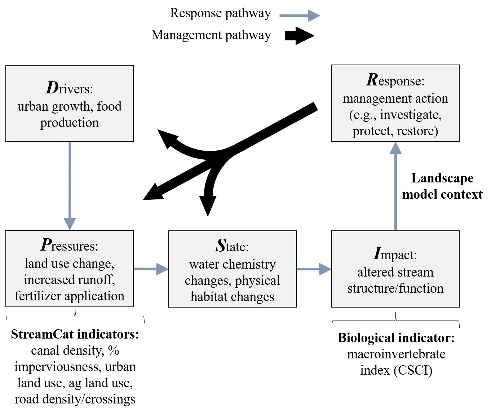
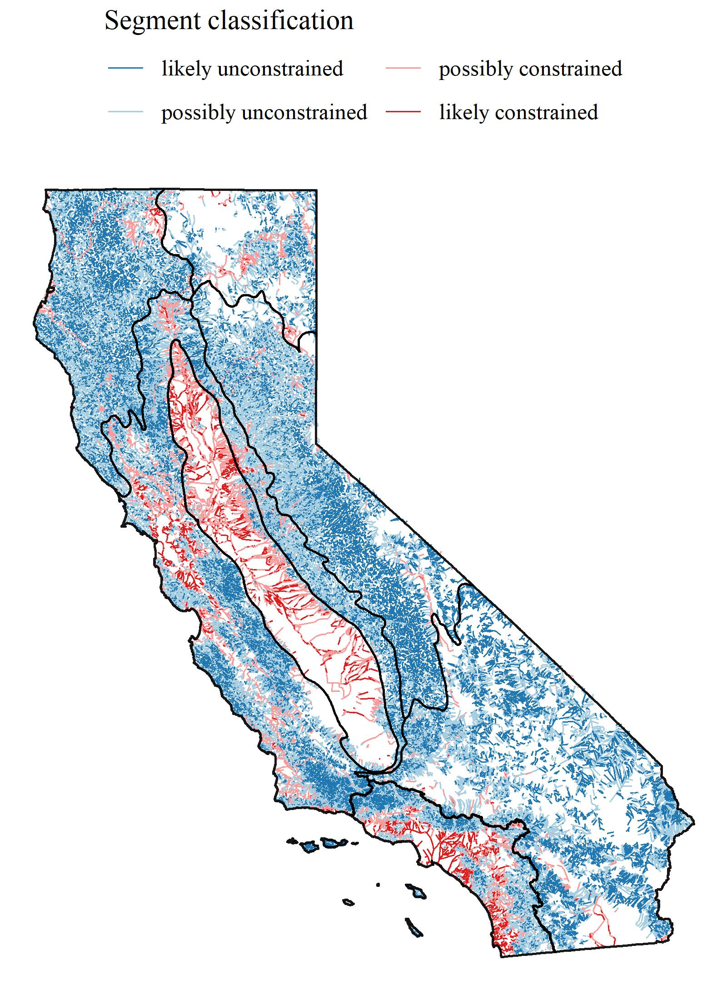

```{r setup, echo = F, warning = F, message = F, results = 'hide'}
# figure path, chunk options
knitr::opts_chunk$set(fig.path = 'figs/', warning = F, message = F, echo = F, cache = T, dev = 'jpeg', dev.args = list(family = 'serif'), dpi = 300, warning = F, out.width = '100%', cache.path = 'manu_draft_cache/',
  fig.process = function(x) {
  x2 = sub('-\\d+([.][a-z]+)$', '\\1', x)
  if (file.rename(x, x2)) x2 else x
  })

# libraries
library(tidyverse)
library(Hmisc)
library(Jabbrev)
library(gridExtra)
library(sf)
library(maptools)
library(maps)
library(grid)
library(ggrepel)
library(RColorBrewer)
library(ggridges)
library(scales)
library(quantregForest)
library(leaflet)
library(raster)
library(flextable)
library(officer)
library(here)

# functions (incl. color palettes)
source(here('R', 'funcs.R'))

# extract bib entries from online
bib_scrp(here('manuscript', 'manu_draft.Rmd'), here('manuscript', 'refs.bib'))

 # data
load(file = here('data', 'typetab.RData'))
load(file = here('data', 'csci_raw.RData'))
load(file = here('data', 'ludat.RData'))
load(file = here('data', 'calipsa.RData'))
load(file = here('data', 'psalab.RData'))
load(file = here('data', 'rf_core.RData'))
load(file = here('data', 'sgrlu.RData'))
load(file = here('data', 'shed.RData'))
load(file = here('data', 'spat.RData'))
load(file = here('data', 'scrs.RData'))
load(file = here('data', 'csci_comid.RData'))
load(file = here('data', 'nhdplo.RData'))
load(file = here('data', 'caliclsplo.RData'))
load(file = here('data', 'calicls.RData'))
load(file = here('data', 'caliexp.RData'))
load(file = here('data', 'comid_prd.RData'))
load(file = here('data', 'strclslen.RData'))
load(file = here('data', 'sensres.RData'))
load(file = here('data', 'typscrs.RData'))
load(file = here('data', 'sgrclslen.RData'))
```

```{r echo = F, cache = F}
raw <- system('git log -1', intern = TRUE)
raw <- raw[grep('^Date', raw)]
raw <- paste('Version', raw)
```
`r raw`

```{r echo = F, cache = F, eval = F}
spelling::spell_check_files(here('manuscript', 'manu_draft.Rmd'))
```

# Abstract 

Stream management goals for biological integrity may be difficult to achieve in developed landscapes where channel modification and other factors constrain in-stream conditions. To evaluate potential constraints on biological integrity, we developed a statewide landscape model for California that estimates ranges of likely scores for a macroinvertebrate-based index that are typical at a site for the observed level of landscape alteration.  This context can support prioritization decisions for stream management, like identifying reaches for restoration or enhanced protection based on how observed scores relate to the model expectations.  Median scores were accurately predicted by the model for all sites in California with bioassessment data (Pearson correlation r = 0.75 between observed and predicted for calibration data, r = 0.72 for validation). The model also predicted that 15% of streams statewide are constrained for biological integrity within their present developed landscape, particularly for urban and agricultural areas in the South Coast, Central Valley, and Bay Area regions. We worked with a local stakeholder group from the San Gabriel River watershed (Los Angeles County, California) to evaluate how the statewide model could support local management decisions.  To achieve this purpose, we created an interactive application, the Stream Classification and Priority Explorer (SCAPE), that compares observed scores with expectations from the landscape model to assign priorities. We observed model predictions that were consistent with the clear land use gradient from the upper to lower watershed, where potential limits to achieving biological integrity were more common in the heavily urbanized lower watershed.  However, most of the sites in the lower watershed scored within their expected ranges, and were therefore given a low priority for restoration. In contrast, two low-scoring sites in the undeveloped upper watershed were prioritized for causal assessment and possible future restoration, whereas three high-scoring sites were prioritized for protection. The availability of geospatial and bioassessment data at the national level suggests that these tools can easily be applied to inform management decisions at other locations where altered landscapes may limit biological integrity.
 
Key words: Bioassessment, biotic integrity, streams, urbanization, modified channels, landscape stressors, random forests, prioritization, data visualization, stakeholder group

# Introduction

The widespread use of bioassessment data to assess ecological condition of aquatic environments is a significant advance over chemical or physical methods of assessment, yet managers and stakeholders require contextual information for synthesizing and interpreting biological information.  The reference condition concept that is built into many biological indices provides a broad context for observed condition relative to unaltered habitats for a particular region [@Reynoldson97;@Stoddard06].  However, achieving a reference condition of biological integrity (i.e., having structure and function comparable to natural habitat for the same region, @Karr86) may be challenging if landscape conditions (e.g., watershed imperviousness) limit the spatial and temporal scales that can be effectively managed [@Chessman04;@Chessman14]. Resource management decisions could be improved if information is available that describes these limitations.  A landscape context is required that describes how likely a site is to achieve biological integrity, which can inform how bioassessment data supports decisions or identifies priorities.  

Prioritizing among sites that are affected by landscape alteration is a critical challenge for managers in urban and agricultural settings [@Walsh05;@Beechi07;@Paul08]. In developed landscapes, the majority of stream miles are in poor biotic condition [@USGS99;@Finkenbine00;@Morgan05]. Restoring streams in urban or agricultural settings can be costly, success is not universally defined, and achieving regional reference-like conditions may be difficult [@Bernhardt07;@Kenney12;@Shoredits13]. Conventional approaches to protect and restore biological integrity have commonly focused on direct improvements at the site level to mitigate instream stressors [@Carline07;@Lester08;@Roni12;@Loflen16], in addition to upstream preventive measures that may be incentivized or enforced through regulation.  Although these approaches can lead to improvements in ecological condition, there is no universal remedy for achieving biological integrity in streams. In urban areas, protective thresholds for biological integrity have been debated [@Cuffney11]. For biological integrity, several states have implemented a tiered aquatic life use or alternative use designations as potential approaches to account for baseline shifts in ecosystem condition from channel modification  (e.g., @FLDEP11, @USEPA13, @MBI16, permitted under section 303(c)(2) of the Clean Water Act).  Other approaches may include site-specific criteria or alternative thresholds with implementation clarifications (e.g., @SDWB16).   

Herein, we define constrained streams as those where present landscapes are likely to limit management options for restoring biological integrity. This definition describes a biological expectation and is distinct from the classical definition used in the general stream ecology literature (e.g., a physically constrained channel in the morphological sense).  By describing an expected range of biological conditions due to factors that constrain biointegrity and may be difficult to manage, efforts to improve or protect condition could be prioritized at sites where alternative or more easily managed factors are influencing condition.  For example, a monitoring site with an observed biological index score that is above an expected range of attainability could be assigned a higher management priority relative to a site that is scoring within the range that is expected based on landscape development.  A predictive model of bioassessment scores that is based on landscape metrics (e.g., imperviousness) could describe constraints on biological integrity, whereas variation of observed scores around a model prediction could suggest other factors at the local scale (e.g., instream physical habitat) are more important. Analysis methods that characterize biotic and abiotic factors that limit assemblage composition have been explored by others (i.e., limiting factor theory, @Chessman08, @Chessman14). Similar concepts have been applied in a landscape context to describe variation in biological communities and metrics at different spatial scales [@Waite13;@Waite14], although they have not been developed to describe constraints as defined above.  

Consistent and empirical links between land use thresholds and poor biotic integrity have been identified in many cases [@Allan97;@Wang97;@Clapcott11] and previous modelling efforts have successfully used geospatial data to predict stream condition at regional or national scales [@Volstad04;@Carlisle09;@Brown12;@Hill17]. Many of these models are based on the understanding of relationships between stream condition and watershed characteristics [@Hynes75;@Johnson97;@Richards97], which can be broadly conceptualized within the Driver-Pressure-Stress-Impact-Response (DPSIR) framework that describes relationships between the origins and consequences of environmental problems [@Smeets99].  However, past efforts have primarily focused on characterizing condition at unsampled locations, often predicting the most likely condition by estimating averages.  Alternative modelling approaches, such as quantile-based methods (e.g., @Cade03), could be used to predict a range of expectations for biotic integrity from geospatial data.  This approach differs fundamentally from previous efforts of estimating average condition by providing an estimate of the minimum and maximum scores that are likely for the landscape context.  Once the responses of macroinvertebrate communities to landscape changes at large spatial scales are understood, expectations can be compared to field samples and sites can be prioritized by local managers based on deviation from the expectation.
     
The goal of this study was to present the development and application of a landscape model to predict a lower and upper bioassessment score that would be expected based on land use. Our specific objectives were to 1) develop and validate the landscape model, 2) apply the model results to categorize all stream segments in California into constraint classes, and 3) provide a case study within a single watershed to demonstrate how model predictions and classifications can be used to prioritize management actions at a local scale. The model was developed and applied to all streams and rivers in California, specifically focusing on the potential of urban and agricultural land use to constrain biological condition. The case study demonstrated how the statewide model could be used to classify and prioritize at the regional scale using guidance from a local stakeholder group from a heavily urbanized watershed where obstacles for achieving biological integrity have been encountered. An interactive software application, the Stream Classification and Priority Explorer (SCAPE), was developed for our case study to help stakeholders choose regional management priorities from the statewide landscape model.

# Methods

## Study area and data sources

California covers 424,000 km$^2$ of land with extreme diversity in several environmental gradients, such as elevation, geology, and climate (Figure \@ref(fig:calimap)a, @Ode16).  Temperate rainforests occur in the north (North Coast region, NC), deserts and plateaus in the northeast and southeast (Deserts and Modoc Plateau region, DM), and Mediterranean climates in coastal regions (Chaparral and South Coast regions, CH and SC).  The Central Valley region (CV) is largely agricultural and drains a large mountainous area in the east-central region of the state (Sierra Nevada region, SN).  Urban development is concentrated in coastal areas in the central (San Francisco Bay Area, Chapparal region) and southern (Los Angeles, San Diego metropolitan area, South Coast) regions of the state.  Landscape alteration has been relatively recent, with one estimate that developed lands increased in California by 38% from 1973 to 2000 [@Sleeter11]. Silviculture and logging activities have also occurred in forested regions (SN, NC).  For analysis, the state was evaluated as a whole and by the major regions described above [@Ode11].

The landscape model was developed using land use data, stream hydrography, and biological assessments. A general assumption was that water quality issues could be conceptually linked to societal and economic drivers, reflected through the link between land use and stream biotic integrity (e.g., under the DPSIR framework, Figure \@ref(fig:dpsirfig), @Smeets99). Stream data from the National Hydrography Dataset Plus (NHD-plus) [@McKay12] were used to identify stream segments in California for modelling biological integrity. The NHD-plus is a surface water framework that maps drainage networks and associated features (e.g., streams, lakes, canals, etc.) in the United States. Stream segments designated in the NHD-plus were used as the discrete spatial unit for modelling biological integrity. Here and throughout, "segment" is defined based on NHD-Plus flowlines.  Hydrography data were combined with landscape metrics available from the StreamCat Dataset [@Hill16] that provided estimates of land use at the riparian zone (i.e., a 100-m buffer on each side of the stream segment), the catchment (i.e., nearby landscape flowing directly into the immediate stream segment, excluding upstream segments), and the entire upstream watershed for each NHD-Plus segment.  Many of the metrics in StreamCat were derived from the 2006 National Land Cover Database [@Fry11]. 

The California Stream Condition Index (CSCI) [@Mazor16] was used as a measure of biological condition in California streams.  The CSCI is a predictive index that compares the observed taxa and metrics at a site to those expected under least disturbed reference conditions [@Stoddard06].  Expected values at a site are based on models that estimate the likely macroinvertebrate community in relation to factors that naturally influence biology, e.g., watershed size, elevation, climate, etc. [@Moss87;@Cao07].  The index score at a site can vary from 0 to ~ 1.4, with higher values indicating less deviation from reference state.  Because the index was developed to minimize the influence of natural gradients, the index scores have consistent meaning across the state [@Mazor16]. A CSCI threshold of 0.79, based on the tenth percentile of scores at all reference calibration sites for the original index, has been proposed as a threshold below which a site does not meet designated biological uses [@SDWB16].  As described below, the expected CSCI scores obtained from the landscape model were compared to this threshold to identify different constraint classes.

Benthic macroinvertebrate data were used to calculate 6270 individual CSCI scores at nearly 3400 unique sites between 2000 and 2016 (Figure \@ref(fig:calimap)b).  We aggregated data collected under more than 20 federal, state, and regional bioassessment programs. Some of these programs employed a spatially balanced probabilistic design (e.g., the statewide Perennial Stream Assessment [@Rehn15], or the Stormwater Monitoring Coalition’s survey of southern California streams, @Mazor15), although other programs used different designs for project-specific purposes (such as the statewide Reference Condition Monitoring Program, @Ode16). Most of these programs targeted perennial streams, although an unknown number of intermittent streams with flows lasting into the normal sampling period were included [@Mazor14], particularly in more arid southern California.  Because these programs are extensive, most regions and stream-types where perennial wadeable streams are located were represented in the calibration data set.

Field samples were collected during base flow conditions typically between May and July following methods in @Ode16b.  Bioassessment sites were snapped to the closest NHD-plus stream segment in ArcGIS [@ESRI16].  In cases where multiple sites were located on the same segment, the most downstream site was selected for model calibration under the assumption that the landscape data in StreamCat was most relevant to this site.  One sample date was chosen randomly for sites with multiple dates so that one CSCI score was matched to a site.  This option was preferred relative to selecting sample dates closest in time to StreamCat estimates because land use did not change dramatically during the sample period.  This created a final dataset of `r sum(csci_comid$SelectedSample %in% 'Selected')` unique field observations used to calibrate and validate the landscape model. 

## Building and validating the landscape model

Expected CSCI scores were modelled using estimates of canal/ditch density, imperviousness, road density/crossings, and urban and agricultural land use for each stream segment (Table \@ref(tab:crvr), Figure S1).  StreamCat was used as the only source for predictor variables because of consistent methods and linkage to NHD-Plus flowlines [@Hill16].  Preliminary analyses indicated that these variables produced a predictive model with comparable performance relative to a larger model with additional variables. These variables were chosen specifically as indicators of land-management activities that were most likely to limit the attainability of biological integrity.  Landscape variables were preferred over in-stream data because landscape stressors can be more challenging to manage, and we wanted to quantify biological impacts relative to these challenges.  Further, presence or absence of channel modification was not used to quantify limits on biological integrity because landscape predictors were more broadly inclusive of the problem (e.g., modified channels are often but not always constrained, constrained channels are not always modified).  Overall, the model was associative by design and was intended as a predictive tool that does not describe specific mechanisms of biological alteration.  We assumed that deviation of observed scores from the model predictions (i.e., residuals) could be used to describe in-stream factors associated with condition for follow-up analysis.

The model was developed using quantile regression forests to estimate ranges of likely CSCI scores in different landscapes [@Meinshausen06;@Meinshausen17]. Random forests are an ensemble learning approach to predictive modelling that aggregates information from a large number of regression trees and have been used extensively in bioassessment applications [@Carlisle09;@Chen14;@Mazor16;@Fox17].  Random forest models provide robust predictions by evaluating complex, non-linear relationships and interactions between variables relative to more commonly-used modelling approaches, such as multiple regression [@Breiman01;@Hastie09].  Quantile models, such as quantile regression forests, evaluate the conditional response across the range of values that are expected, in contrast to conventional models that provide only an estimate of the mean response [@Cade03]. This modelling approach allows use of prediction intervals to describe the range of likely scores, which can be used to identify sites where that range includes management targets.  Quantile regression forests were used to predict CSCI scores in each stream segment at five percent increments (i.e., 5th, 10th, etc.) from the 5th to 95th percentile of expectations.  The statewide validated model (described below) was used to predict percentile expectations of CSCI scores at all stream segments where predictors were available.  For example, the 50th percentile prediction was the most likely score for a stream segment given observed values for landscape variables, whereas a lower (e.g., 5th percentile) and upper (95th percentile) bound on the median (and points in between) were also predicted.  The quantregForest package [@Meinshausen17] for the R Statistical Programming Language [@RDCT18] was used to develop the landscape model using the default settings, with the exception that out of bag estimates were used for model predictions.

We stratified sample data to ensure sufficient representation of landscape gradients across major regions in the state (Figure \@ref(fig:calimap)). Calibration data for the landscape model were obtained from a random selection of 75% of segments with observed CSCI scores, where the selection was based on a random draw among sites that were grouped into quartiles defined by increasing watershed imperviousness relative to each region (n = 1965 segments).  This ensured that the model was calibrated with data that covered the variation of landscape development between regions (i.e., regions with low development were not under-represented and those with high development were not over-represented). The remaining sites were used for model validation (n = 655). Where multiple samples were available at a single site, one sample was selected at random for both calibration and validation purposes. Model performance was assessed for the statewide dataset and within each major region by comparing differences between observed CSCI scores and median predictions at the same locations.  Differences were evaluated using Pearson correlations and root mean squared errors (RMSE); high correlation coefficients and low RMSE values indicated good performance.  Regression analysis between observed and predicted scores was used to assess potential bias based on intercept and slope values differing from 0 and 1, respectively.  Collectively, the performance metrics were chosen to evaluate both predictive ability of the landscape model and potential for bias which may vary depending on different land use gradients across the state.

## Statewide application of the landscape model

We applied the landscape model to `r nrow(comid_prd)` stream segments statewide to estimate the extent of streams in one of four different constraint classes: likely unconstrained, possibly unconstrained, possibly constrained, and likely constrained (Table \@ref(tab:clsdef)). The classification process is described in Figure \@ref(fig:ridges)a through c. Classifications were based on the comparison of a CSCI threshold representing a management goal and the predicted range or predicted median score at a segment.  These two decision points (i.e., the threshold and the size of the predicted range) were critical in defining segment classifications.  We used a CSCI threshold of 0.79 (i.e., the 10th percentile of reference calibration sites) following previous examples [@Mazor16;@SDWB16] and a prediction interval ranging from the 10th to the 90th percentiles of expected CSCI scores.  Stream segments with the range of CSCI score expectations entirely below the threshold were considered likely constrained, whereas those with expectations entirely above were considered likely unconstrained (Figure \@ref(fig:ridges)c).  The remaining sites were classified as possibly unconstrained or possibly constrained, based on whether the median expectation was above or below the threshold respectively (Table \@ref(tab:clsdef)).  

The influence of the key decision points on the extent of segment classifications created by the landscape model was evaluated.  Stream segment classifications depend on the chosen range of score expectations (or certainty) from the landscape model (Figure  \@ref(fig:ridges)b) and the CSCI threshold for evaluating the overlap extent (Figure \@ref(fig:ridges)c).  For the certainty range, this interval does not describe statistical certainty in the traditional sense (e.g., confidence interval), but rather a desired range that is defined as a potentially acceptable lower and upper bound around the median prediction for a CSCI score given landscape development. Eight different ranges of values for the score expectations from wide to narrow were evaluated at five percent intervals, i.e., 5th-95th, 10th-90th, ..., 45th-55th.  Different CSCI thresholds were also evaluated using values of 0.63, 0.79, and 0.92, corresponding to the 1st, 10th, and 30th percentile of scores at reference calibration sites used to develop the CSCI (Figure \@ref(fig:calimap)b) [@Mazor16].  The percentage of stream segments in each class statewide and by major regions were estimated for each of the twenty-four scenarios (width by threshold combinations).

A categorization scheme was developed for sites where biomonitoring data were available to compare observed CSCI scores to the range of expected scores from the model (Figure \@ref(fig:ridges)d). This post-hoc classification was necessary to determine if observed CSCI scores were under- or over-scoring relative to landscape expectations and can serve to help prioritize management actions.  For example, managers may choose to prioritize sites with index scores above or below the landscape model predictions differently than those that are within the expected range. Sites with observed scores above the upper limit of the segment expectation (e.g., above the 90th percentile of expected scores) were considered "over-scoring" and sites below the lower limit (e.g., 10th percentile) were considered "under-scoring".  If neither "over-scoring" nor "under-scoring", the site was considered as "expected" within the context of the landscape model.   

# Results

## Model performance

Model performance statewide indicated generally good agreement between observed CSCI scores and the median prediction for the associated stream segment (Table \@ref(tab:perftab), Figure S2).  Agreement between observed and predicted values for the entire calibration dataset was r = 0.75 (Pearson) and RMSE = 0.17.  The intercept and slope for a regression between observed and predicted values were 0.04 and 0.93, suggesting minimal bias of predictions.  The statewide validation data showed similar results, with slightly smaller correlation (r = 0.72) and larger RMSE (0.18) estimates.  

Overall, the model performed well in regions with a mix of urban, agricultural, and open land (e.g., South Coast and Chaparral regions), whereas performance was weakest in regions without strong development gradients (e.g., Sierra Nevada region) (Table \@ref(tab:perftab), Figure S2, S3).  Performance for the Chaparral and South Coast regions were comparable or slightly improved compared to the statewide dataset for both the calibration (r = 0.71, 0.75, respectively) and validation (r = 0.74, 0.72) datasets. Model predictions for the Central Valley, Desert/Modoc, and North Coast regions had slightly lower performance compared to the statewide results, with correlations of approximately 0.66, 0.50, and 0.55 with observed values in the calibration dataset and 0.49, 0.55, and 0.55 in the validation dataset.  Model performance was weakest for the Sierra Nevada region, where timber harvesting, rather than urban or agricultural development, is the most widespread stressor.  A slight bias in model predictions was observed for the Central Valley and North Coast, where the former was over-predicted and the latter was under-predicted (Figure S2).  

## Statewide patterns in stream constraints

Statewide patterns in stream constraints were apparent from the results of the landscape model that were consistent with land use (Figure \@ref(fig:calires)).  A majority of stream segments statewide were classified as possibly constrained (11% of all stream length) or possibly unconstrained (46%), whereas a minority were likely constrained (4%) or likely unconstrained (39%) (Table \@ref(tab:clstot)). Likely unconstrained streams were common in the Sierra Nevada (50%), North Coast (46%), and Desert/Modoc (46%) regions, whereas likely constrained were relatively abundant in the Central Valley (22%) and South Coast (15%) regions.  However, constrained and unconstrained streams were both found in every region (Figure \@ref(fig:calires))

Observed CSCI scores were within the predicted range as often as expected (i.e., 80% statewide, based on the 10th and 90th prediction interval), and over-scoring sites were roughly as common (9%) as under-scoring sites (10%) (Table \@ref(tab:reltot)).  Similar patterns were observed within regions, although a slightly larger percentage of sites in the Central Valley were under-scoring compared to the other regions, which may have been caused by a slight bias of over-predicting in this region. Over-scoring sites were slightly more common in certain regions (i.e., the South Coast and Sierra Nevada regions) than others (i.e., the Chaparral, Central Valley, and Desert/Modoc regions). 

Changing key decision points of the landscape model affected the estimates of the extent of streams in each class (Figure \@ref(fig:sensplo)). Unsurprisingly, decreasing the certainty of predictions from the landscape model by narrowing the prediction interval (5th-95th to 45th-55th) shifted a number of streams from the possible to likely category in both constrained and unconstrained segments. Similarly, changing the CSCI threshold from relaxed to more conservative (0.63 to 0.92) increased the number of streams classified as possibly or likely constrained and decreased the number of streams as possibly or likely unconstrained. However, the effects of these decision points varied greatly by region. For example, over 80\% of segments in the Central Valley were classified as likely constrained using a high CSCI threshold with the narrowest range of predictions, whereas less than 1\% of segments were in this category using a low CSCI threshold with the widest range of predictions. Opposite trends were observed in regions with reduced land use pressures. For example, almost all stream segments in the North Coast and Sierra Nevada regions were classified as likely unconstrained using a low CSCI threshold and narrow range of predictions.

# Discussion

Managing for biological integrity requires the use of 1) assessment tools that can accurately evaluate condition, and 2) tools that can provide a landscape context for evaluating observed conditions.  The landscape model was developed with these needs in mind to better inform application of the CSCI for decision-making relative to landscape constraints on biological condition.  Statewide application of the model demonstrated where streams are likely constrained on a regional basis, whereas application in a case study (described below) demonstrated how the model can be used by local stakeholders to prioritize management actions that are informed by landscape context. The landscape model can inform the interpretation of biotic condition and is a decision-making tool that can help identify where management goals could be focused. 

Results from our analysis could be used for managing the biological integrity of streams under state or federal water quality mandates (e.g. "biological criteria" under the Clean Water Act).  Management activities for biological integrity could involve the protection of sites meeting biological objectives or the restoration of sites that do not meet biological objectives.  The selection of appropriate management actions for streams requires the consideration of the physical and chemical condition of streams concurrent with biological monitoring results.  The landscape model can place observed scores in an appropriate context relative to their modeled condition within the landscape.  This information could provide flexibility in the selection of regulatory or management actions at specific sites or watershed scales (e.g., hydrologic subareas), and to further prioritize where and when actions should take place based on the temporal and spatial scale needed for protection or restoration actions.  For example, for sites that meet biological objectives but where the models predict some degree of constraint, regulatory actions may be associated with protecting that condition and could be implemented in the short-term to prevent degradation.  Moreover, additional actions could be recommended to determine why these sites score above the constrained expectations, such as causal assessments to identify site-specific characteristics contributing to biointegrity (e.g., intact physical habitat independent of landscape development).  This flexibility is not intended to exclude sites from consideration that are less likely to achieve biological objectives, but rather to facilitate the decision-making process through a more transparent application of the model in a regulatory application.  The landscape model could also support the development of Tiered Aquatic Life Uses (TALU, @Davies06), such as identifying locations where tiered uses could apply.  However, the model is not intended, nor is it is sufficient, as a standalone tool for defining tiered uses.

Non-regulatory applications of the landscape model are also possible by identifying where additional restoration, monitoring, or protection may have the most benefit.  For example, landscape models could be used to support conservation planning, particularly at the watershed scale where land use practices can be a critical factor for decision-making.  Ongoing work in California has focused on setting priorities for managing biodiversity that focus on watersheds within a conservation network [@Howard18].  Results from the landscape model could be used to enhance this network by providing supporting information on constraints in an assessment framework. More generally, these applications could represent a novel use of bioassessment data beyond the pass/fail paradigm in the regulatory sense, for example, as tools for land use planning [@Bailey07]. In many cases, including California, bioassessment indices have been sufficiently developed to allow large-scale condition assessment across regions, yet they are rarely used as planning tools to guide decisions on where resources should be focused [@Nel09].  Our landscape model makes bioassessment data in California more accessible and identifies an appropriate expectation for the information, enabling the potential for both regulatory and non-regulatory applications.

## Case study: Application of the landscape model to the San Gabriel River watershed

The statewide model only provides landscape context for an observed score, whereas management priorities relative to modelled expectations must be separately defined in a regional context. For example, managers may prioritize sites with bioassessment scores that are above the modelled expectation differently than those that are scoring within the ranges predicted by the model.  Alternatively, a site scoring as expected in an unconstrained segment could be prioritized differently than a site scoring as expected in a constrained segment.  Results from the statewide model were used to develop a regional context for observed CSCI scores through local application with a stakeholder group from the San Gabriel River watershed (Los Angeles County, California, Figure S4).  The lower watershed is heavily urbanized with many modified channels and managers require priorization tools to identify where efforts should be focused in the context of landscape development.  Information from the landscape model allowed the stakeholder group to develop management priorities based on the biological expectations (Figure S5).   

The priorities defined by the group were generalized into three categories (Table S1, Figure S6):

* Investigate:  Conduct additional monitoring or review of supplementary data (e.g., field visits, review aerial imagery);
* Protect: Recommend additional scrutiny of any proposed development and/or projects; 
* Restore: Pursue targeted action for causal assessment and/or restoration activity.  

In general, the stakeholder group assigned high priority recommendations to over- and under-scoring sites in likely unconstrained segments or those below the biological threshold with possibly unconstrained classification (Figure S6, Table S1).  Continuing current practices (e.g., routine monitoring) were generally recommended at constrained sites or restoration actions were recommended as a lower priority despite low CSCI scores. Recommended actions to investigate were more common for both over-scoring and under-scoring sites, protect was given a high priority exclusively at over-scoring sites, and restore was more common at under-scoring sites.  

The landscape model is primarily an exploratory tool to help identify patterns among monitoring sites where more intensive analyses may be appropriate. This application was effectively demonstrated through engagement of our local stakeholder group.  Rather than identifying individual sites in need of specific management actions, the group used the landscape model to characterize patterns on the landscape that were consistent with the recommended management priorities.  In doing so, the group was able to explore and discuss potential management actions relative to the landscape characteristics of the watershed. The final decision by the group to prioritize management actions for the different sites in broad categories of protect, restore, and investigate was based on an iterative process where ideas were discussed and shared freely among stakeholders. This approach ensured that stakeholders were generally in agreement with the final product and, therefore, potentially more likely to adopt the recommendations provided by these tools in formal decision-making [@Stein17]. The recommended actions have relevance only in the interests of the San Gabriel Regional Monitoring Program. Localized applications of the statewide model must engage stakeholders in a similar process to develop recommendations that are specific to regional needs at the watershed scale [@Brody03;@Reed08].  

Engagement with the stakeholder group was facilitatied through creation of an interactive and online application, the Stream Classification and Priority Explorer (SCAPE, Figure S7, [http://shiny.sccwrp.org/scape/](http://shiny.sccwrp.org/scape/))[@Beck18c]. The SCAPE application was used to select and visualize management priorities for all monitoring sites in the San Gabriel watershed (Figure S8) and was also critical for demonstrating how results from the statewide model could be used at a regional scale.  The application demonstrated core concepts of the model and allowed stakeholders to explore the key decision points that affect the model output, specifically related to changing certainties in the CSCI score predictions (e.g., 10th and 90th percentile predictions) and the ability to explore alternative thresholds for biological objectives (e.g., 10th percentile of reference scores that defined constraint classes).  This functionality allowed the stakeholders to develop recommendations that were completely independent of the model, i.e., decisions were not hard-wired into the model nor SCAPE. Because of this application, this stakeholder group has a better understanding of the potential impacts of biointegrity policies currently under review in California.  Additionally, the SCAPE application provided assurance to the prioritization process by correctly identifying sites where discrepancies between CSCI scores and other measures of stream condition had been observed. Without this information (i.e., Figure S5), stakeholders struggled to prioritize among sites, particularly for restoration activities.  For example, some advocated that the lowest scoring sites should be prioritized, whereas others prioritized sites that scored just below the CSCI threshold. Conflicting priorities were common in the absence of information about the range of scores typical for these urban settings.

## Alternative applications of the landscape model 

Several states have implemented alternative use designations for applying bioassessment criteria in modified channels [@FLDEP11;@USEPA13;@MBI16]. Although our results generally support the link between impacted biology and channel modification, a regulatory framework based on direct channel modification may be insufficient because constraints are more accurately defined relative to landscape development. As defined for the model, a constrained channel may or may not be engineered, but an engineered channel will typically be constrained given the surrounding land use.  For example, Tecolote Creek (San Diego County, USA) was identified by our model as a constrained channel in an urban landscape (Figure \@ref(fig:tecolote)).  The CSCI score is 0.61 indicating degraded biological integrity, but the channel is not modified [@Rehn18].  Other stressors originating at the landscape scale (e.g., water or sediment chemistry) have likely constrained the biological community at this site independent of the physical habitat quality.  Furthermore, channel modification does not always result in biological degradation, particularly if the contributing watershed is largely undeveloped.  For example, @Stein13 observed reference-like bioassessment index scores in armored reaches within national forest lands in southern California.  A classification framework for biological constraints using only channel modification would provide incomplete and potentially misleading information on streams.  Ideally, context for evaluating biological condition from a landscape model, in conjunction with reach-specific data on channel modification, should be used.

Our approach to assessing constrained streams is readily transferable outside of California. The landscape model could be applied to other bioassessment methods, such as a multi-metric index (the most common bioassessment approach within the US; @Buss14), O/E assessments [@Moss87], biological condition gradients [@Davies06], or with other biological endpoints (e.g., fish or diatoms). More importantly, our use of national geospatial datasets (i.e., NHDPlus, @McKay12; StreamCat, @Hill16) means that these methods could be applied across the United States.  National bioassessment indices have been developed and the landscape model could be developed as a national-scale product of constraints on biological condition to complement recent work that predicted probable biological conditions with the National Rivers and Streams Assessment [@Hill17].  Global geospatial datasets of freshwater-specific environmental variables are also available and could be used to develop similar models outside of the United States [@Domi15].

Extension of the landscape models beyond California should also consider landscape stressors that are predictive of biotic condition in other regions. For example, urban and agricultural gradients were sufficient to characterize constraints in many regions of California, whereas @Hill17 found that the volume of water stored by dams was an important predictor of biological condition in the Northern Appalachian and Northern Plains regions of the US. In their paper, @Hill17 provided an example of how predictive models could be used to identify potential sites for restoration or conservation, however, their illustration did not explicitly identify sites that were over- or under-scoring relative to a biological endpoint. Doing so in California provided stakeholders with relative information that helped establish management priorities, demonstrating the potential utility of this approach in other states.

# Model assumptions and limitations

There are several characteristics of the landscape model that could affect its performance when applied outside of urban and agricultural settings.  First, the model was developed with a focus on the needs of managers that apply bioassessment tools in developed landscapes where conditions are presumably constrained.  As such, landscape variables were chosen to capture the effects of development on CSCI scores in these areas (Table \@ref(tab:crvr)).  Application of the model in regions where different stressors have strong impacts on stream condition should consider the relevance of urban and agricultural stressors and if an alternative model that better captures other stressor gradients is needed.  For example, our results suggest that streams in the North Coast and Sierra Nevada regions are largely unconstrained, but the landscape model was a poor predictor of CSCI scores in these areas.  The dominant stressors likely to affect stream condition in these regions originate from sources that are less common in developed landscapes, such as silviculture and cannabis cultivation.  The current landscape model does not adequately capture these impacts outside of urban and agricultural environments. Moreover, poor model predictions are compounded by low sensitivity of the CSCI to relevant stressor gradients in these regions [@Mazor16]. Accurate data for quantifying these potential stressors are not available in StreamCat, but this is an area where investments in improving spatial data could yield significant improvements in further development of bioassessment indices and tools for their interpretation.
 
An additional assumption is that the landscape model can adequately discriminate between intractable constraints on biology that are spatially and temporally pervasive relative to more manageable constraints.  That is, we assumed that the impacts of stressors included in the model, such as urbanization, require long-term extensive mitigation planning, whereas stressors associated with deviations from model predictions can be mitigated in the short-term using focused actions.  These assumptions are not unique to our model and have been used in other applications that have evaluated biological potential [@Paul08;@Chessman14;@Waite14]. However, many stressors excluded from the model can have long-lasting impacts, leading to management scenarios where long-term recovery may only be possible with sustained and costly application of resources.  For example, logging activities can impact benthic macroinvertebrate communities for a decade or more after harvesting activities have stopped [@Stone98;@Quinn08]. In urban areas, pervasive and profound alteration to groundwater and hydrology is common and stream communities in groundwater fed systems may require substantial time and resources for restoration.  The potential legacy impacts of large-scale alterations of the natural environment are not well-captured by the current model, neither from a spatial nor temporal perspective. A more refined application of the landscape model would be necessary to evaluate different scales of impact, which could include developing separate models for each region, as well as more careful selection of model inputs to capture scales of interest for potential impacts on stream condition.

The landscape model is associative by design and does not identify mechanistic links between biological constraints and proximal causes.  The model describes constraints at scales larger than instream characteristics as a necessary approach to accurately predict bioassessment scores.  Additional analyses that evaluate how different predictors influence model performance at different quantiles could provide insight into how landscape factors relate to constraints [e.g., @Koenker99]. Further, a distinction between constraints on biological condition and channel modification is implicit such that indication of the former by the model does not explicitly indicate presence of the latter.  As noted above, our results consistently indicated that engineered channels are biologically constrained, but the model is based on an a priori selection of land use variables to predict biotic integrity.  A correspondence between habitat limitations and channel modification is likely in many cases but data are insufficient to evaluate biological effects statewide relative to land use constraints.  Moreover, bioassessment scores can be similar in modified channels compared to natural streams independent of watershed land use, i.e., concordance between degraded stream condition and channel modification may not always be observed [@Stein13].  More comprehensive assessments at individual sites may be needed to diagnose the immediate causes of degraded condition.       

An additional consideration in using the landscape model is the meaning of biologically constrained relative to whole stream communities.  Biologically constrained sites were considered those where present landscapes were likely to limit CSCI scores that describe macroinvertebrate condition. In many cases, poor biotic condition of the macroinvertebrate community translates to poor stream condition.  However, a constrained macroinvertebrate community does not always mean other biological attributes of stream condition (e.g., fish assemblages) are also constrained.  Urban streams sometimes support diverse algal assemblages such that algal-based measures of biotic condition may alternatively suggest good biotic condition relative to macroinvertebrate-based indices [@Brown09;@Mazor18]. Broadening the landscape model to include multiple taxonomic assemblages or endpoints would allow a more complete assessment of how condition relates to landscape alteration.

Finally, there are a few concerns applying a landscape modelling approach for bioassessment using the NHD-Plus flowlines as a base layer.  We applied our model to the entire network of the NHD-Plus represented in StreamCat, which included a large number of intermittent or ephemeral streams, as well as non-wadeable rivers. Therefore, the application of model results in these stream-types is open to question, valid only to the degree that the CSCI and its response to landscape disturbance can represent more relevant measures of biological integrity. In regions where ephemeral streams are particularly common (e.g., the inland deserts or the South Coast region), estimates of the extent of constrained or unconstrained streams may be inaccurate. 

## Summary

The landscape model can be used to characterize the extent of biologically constrained channels in urban and agricultural landscapes.  Our application to the San Gabriel watershed demonstrated how the results of the model can be used at a spatial scale where many management decisions are implemented through close interaction with a regional stakeholder group with direct interests in the local resources.  Overall, the model provides a tool to determine how managers can best prioritize resources for stream management by understanding landscape factors that might constrain each segment.  The approach leverages information from multiple sources to develop a context for biological assessment that provides an expectation of what is likely to be achieved based on current land use development. This can facilitate more targeted management actions that vary depending on the landscape context and can also inform decisions on extent and effort for future monitoring locations.   

# Supplement

Geospatial data of model results mapped to stream reaches in California is provided at @Beck18d. The SCAPE model application website is available at [http://shiny.sccwrp.org/scape/](http://shiny.sccwrp.org/scape/), full source code accessible at @Beck18c. Additional of the case study, figures, and tables are available in the supplement.

# Author contributions

MB, RM, SJ, KW, JW, PO, RH, CL, MS, and ES performed the research and analyzed the data.  MB, RM, SJ, JW, PO, RH, and CL wrote the paper.  RM, SJ, KW, and PO provided data.  All authors discussed the methods and results and contributed to the development of the manuscript.  

# Acknowledgments

The authors acknowledge support from the San Gabriel River Regional Monitoring Program and the California State Water Resources Control Board.  We thank Phil Markle and Lester Yuan for reviewing an earlier draft of the manuscript. The views expressed in this article are those of the authors and do not necessarily represent the views or policies of the U.S. Environmental Protection Agency. Any mention of trade names, products, or services does not imply an endorsement by the U.S. Government or the U.S. Environmental Protection Agency. The EPA does not endorse any commercial products, services, or enterprises.     

# Figures

```{r calimap, fig.height = 5, fig.width = 7, fig.cap = 'Urban and agricultural land use (a) and distribution of observed stream CSCI scores (b) in California. Cover of urban and agricultural land use in stream watersheds was used to develop a landscape model for stream segment expectations of bioassessment scores.  Breakpoints for CSCI scores are the 1st, 10th, and 30th percentile of scores at least-disturbed, reference sites throughout the state.  Altered and intact refers to biological condition [@Mazor16]. Grey lines are major environmental regions in California defined by ecoregional and watershed boundaries, CV: Central Valley, CH: Chaparral, DM: Deserts and Modoc Plateau, NC: North Coast, SN: Sierra Nevada, SC: South Coast.'}

lucol <- c('grey80', 'grey45')

# country base
country <- map_data('state')

# state base
calista <- map_data('state', region = 'california')

# csci seq for color pal
palseq <- range(csci_raw$CSCI, na.rm = T) 
palseq <- seq(palseq[1], palseq[2], length = 5)

# psa data fortified
psadat <- calipsa %>% 
  as('Spatial') %>%
  as.data.frame %>% 
  rownames_to_column('id') %>% 
  dplyr::select(id, PSA6) %>% 
  dplyr::rename(PSA = PSA6) %>% 
  mutate(Region = factor(PSA, 
                         levels = c('Central Valley', 'Chaparral', 'Deserts Modoc', 'North Coast', 'Sierra Nevada', 'South Coast'),
                         labels = c('CV', 'Ch', 'DM', 'NC', 'SN', 'SC')
  ))
psafrt <- calipsa %>% 
  dplyr::select(-PSA_REGION, -AREA, -PERIMETER, -PSA8) %>% 
  as('Spatial') %>% 
  fortify %>% 
  left_join(psadat, by = 'id')

# psalab
psalab <- psalab %>% 
  mutate(
    lat = ifelse(Region == 'CV', 37.26575, lat), # fiddle with locs
    long = ifelse(Region == 'CV', -120.6, long),
    lat = ifelse(Region == 'CH', 36, lat),
    long = ifelse(Region == 'CH', -121, long),
    Region = as.character(Region),
    Region = paste0('bold(', Region, ')')
  )

# land use data fortified  
toplo <- ludat %>% 
  as('Spatial') %>% 
  fortify %>% 
  filter(id %in% c(2, 3)) %>% 
  mutate(id = factor(id, levels = c(2, 3), labels = c('Agriculture', 'Urban'))) %>% 
  dplyr::rename(`Land use` = id)

# csci_raw with percentile ref categories
csci_raw <- csci_raw %>% 
  mutate(
    CSCI = cut(CSCI, 
                   breaks = c(-Inf, 0.63, 0.79, 0.92, Inf), 
                   labels = c('< 0.63', '0.63 - 0.79', '0.79 - 0.92', '> 30^{th}')
                   )
  ) %>% 
  filter(!is.na(CSCI))
  
# legend labels for csci categories in p2
leglab <- list(
  expression(paste('<1' ^ 'st', ': Very likely altered')),
  expression(paste('1'^'st', ' to 10'^'th',': Likely altered')),
  expression(paste('10'^'th', ' to 30'^'th',': Possibly altered')),
  expression(paste('>30'^'th',': Likely intact'))
)

p1 <- ggplot() + 
  geom_polygon(data = toplo, aes(x = long, y = lat, fill = `Land use`, group = group)) + 
  geom_polygon(data = psafrt, aes(x = long, y = lat, group = group), fill = NA, colour = scales::alpha('black', 0.7), size = 0.1) +
  geom_polygon(data = calista, aes(x = long, y = lat, group = group), fill = NA, colour = scales::alpha('black', 0.7))

# text with outline magic
theta <- seq(pi/8, 2*pi, length.out=16)
xo <- diff(range(psalab$long))/200
yo <- diff(range(psalab$lat))/200
for(i in theta) {
  p1 <- p1 + geom_text_repel(data = psalab, 
                             aes_q(x = bquote(long +.(cos(i)*xo)),
                                   y = bquote(lat +.(sin(i)*yo)),
                                   label = ~Region), point.padding = NA, parse = T, family = 'serif', size = 6.5, colour = 'black')
  
}
p1 <- p1 +
  geom_text_repel(data = psalab, aes(x = long, y = lat, label = Region), point.padding = NA, parse = T, family = 'serif', size = 6.5, colour = 'white') + 
  coord_map() + 
  scale_fill_manual(values = lucol) +
  theme_void(base_family = 'serif') + 
  theme(
    legend.position = 'top',
    legend.title = element_blank()
  ) + 
  guides(fill = guide_legend(ncol = 1)) +
  ggsn::scalebar(location = 'bottomleft', y.min = 33, y.max = 35, x.min = -124, x.max = -120, 
                 dist = 150, st.dist=.15, st.size = 3, height = 0.1, dist_unit = 'km', model = 'WGS84', transform = T) +
  ggtitle('(a) Land use and regions')

p2 <- ggplot(csci_raw, aes(x = Longitude, y = Latitude, colour = CSCI)) +
  scale_colour_manual(
    values = pal(seq(0, 1.4, length = 4)), 
    labels = leglab
    ) +
  geom_point(size = 1.25, alpha = 0.7) +
  geom_polygon(data = psafrt, aes(x = long, y = lat, group = group), fill = NA, size = 0.1, colour = scales::alpha('black', 0.5)) +
  geom_polygon(data = calista, aes(x = long, y = lat, group = group), fill = NA, colour = scales::alpha('black', 0.5)) +
  coord_map() + 
  theme_void(base_family = 'serif') + 
  theme(
    legend.position = 'top',
    legend.title = element_blank()
    ) +
  guides(colour = guide_legend(ncol = 2)) +
  ggtitle('(b) CSCI scores')

pinset <- ggplot(country, aes(x = long, y = lat, group = group)) +
  geom_polygon( fill = NA, color = "black", size = 0.3) +
  geom_polygon(data = calista, fill = 'black', color = "black", size = 0.3)+
  coord_map() +
  theme_void() 

grid.newpage()
v1 <- viewport(width = 1, height = 1, x = 0.3, y = 0.48) 
v2 <- viewport(width = 1, height = 1, x = 0.7, y = 0.48) 
v3 <- viewport(width = 0.25, height = 0.25, x = 0.85, y = 0.63)

# png('figs/calimap.png', height = 5, width = 7.1, units = 'in', res = 300, family = 'serif')
print(p1, vp = v1) 
print(p2, vp = v2)
print(pinset, vp = v3)
# dev.off()
```

```{r dpsirfig, fig.cap = "Conceptualized response and management pathways captured by the landscape model under the Driver-Pressure-Stress-Impact-Response (DPSIR) framework [@Smeets99].  Landscape predictors provided in StreamCat [@Hill17] were used to describe pressures from urban and agricultural development that could impact the macroinvertebrate community in streams by altering physical and chemical habitat.  Biological response was measured using the CSCI [@Mazor16] as an impact indicator and then evaluated relative to ranges of CSCI scores that were expected at each site provided by the landscape model.  Observed CSCI scores and context from the landscape model provide a basis for informing management actions that could address environmental impacts at different points in the response pathway, where the management pathway could address causes at different scales and efficiencies."}

```

```{r ridges, fig.height = 5, fig.width = 8, fig.cap = 'Application of the landscape model to identify site expectations and bioassessment performance for sixteen example stream segments.  A range of CSCI scores is predicted from the model (a) and the lower and upper limits of the expectations are cut to define a certainty range for the predictions (b).  Overlap of the certainty range at each segment with a chosen CSCI threshold (c) defines the stream segment classification as likely unconstrained, possibly unconstrained, possibly constrained, and likely constrained.  The observed bioassessment scores are described relative to the classification as over scoring (above the certainty threshold), expected (within), and under scoring (below) for each of four stream classes (d).'}
##
# plot data

# plot data globals
sel <- 4
bnd <- 0.1
pts <- 2000
qts <- 0.1
thrsh <- 0.79

catcds <- data.frame(
  int = c('111', '011', '001', '000'),
  cls = c('likely unconstrained', 'possibly unconstrained', 'possibly constrained', 'likely constrained'),
  clsabv = c('lu', 'pu', 'pc', 'lc')
)

prfcds <- data.frame(
  int = c('00', '01', '11'), 
  cls = c('over scoring', 'expected', 'under scoring')
)

prflev <- c('over scoring', 'expected', 'under scoring')

scrs <- tibble(
  scrshyp = c(1.35, 1.15, 0.84, 0.6, 1.25, 0.95, 0.75, 0.53, 1.1, 0.83, 0.60, 0.35, 1, 0.75, 0.45, 0.15),
  id = factor(rep(1:sel, each = 4), levels = rev(1:sel))
  ) %>% 
  group_by(id) %>% 
  nest %>% 
  rename(scrshyp = data)

# plot data
set.seed(433)
rnd <- data.frame(
  id = factor(rev(1:sel), levels = rev(1:sel)),
  ave = rep(seq(0.5, 1.1, length = 4)),
  sds = sample(c(0.13), sel, replace = T)
  ) %>%
  group_by(id) %>% 
  nest %>%
  left_join(scrs, by = 'id') %>% 
  mutate(
    rnd = purrr::map(data, ~ rnorm(pts, .x$ave, .x$sds)), 
    estall = purrr::map(rnd, function(x){
      
      est <- density(x, n = pts, bw = bnd)
      out <- data.frame(
        xout = est$x, 
        hght = est$y
      )
      
      return(out)
      
    }), 
    estcut = purrr::pmap(list(rnd, estall), function(rnd, estall){
      
      qts <- quantile(rnd, c(qts, 1 - qts))
      out <- estall %>% 
        filter(xout >= qts[1] & xout <= qts[2])
      
      return(out)
      
    }), 
    estcat = purrr::map(estcut, function(x){
      
      out <- c(range(x$xout), median(x$xout)) %>% 
        sort %>% 
        findInterval(., thrsh) %>% 
        paste(collapse = '') %>% 
        factor(levels = catcds$int, labels = catcds$clsabv) %>% 
        as.character
      
      return(out)
      
      
    }), 
    prfcat = purrr::pmap(list(estcut, scrshyp), function(estcut, scrshyp){
      
      interval <- range(estcut$xout) 
      out <- sapply(scrshyp[[1]], function(x) findInterval(interval, x), simplify = F) %>% 
        lapply(., function(x) paste(x, collapse = '')) %>% 
        unlist %>% 
        factor(levels = prfcds$int, labels = prfcds$cls) %>% 
        as.character
      
      return(out)
      
    })
  )

toplo1 <- rnd %>% 
  dplyr::select(id, estall) %>% 
  unnest  

toplo2 <- rnd %>% 
  dplyr::select(id, estcut) %>% 
  unnest

toplo3 <- rnd %>% 
  dplyr::select(id, estcut, estcat) %>% 
  unnest(estcat) %>% 
  unnest %>% 
  mutate(
    estcat = factor(estcat, levels = catcds$clsabv, labels = catcds$cls)
  ) %>% 
  dplyr::rename(`Stream class` = estcat) 

toplo4 <- rnd %>% 
  dplyr::select(id, estcat, scrshyp, prfcat) %>% 
  unnest(estcat) %>%
  unnest %>% 
  mutate(
    prfcat = factor(prfcat, levels = prflev),
    estcat = factor(estcat, levels = catcds$clsabv, labels = catcds$cls),
    hght = scrshyp
  ) %>% 
  dplyr::rename(
    `Relative site score` = prfcat,
    `Stream class` = estcat
  )

##
# plots

# stream class colors
exp_col <- RColorBrewer::brewer.pal(9, 'Paired')[c(2, 1, 5, 6)] %>% 
  alpha(., 0.8)  

# plot globals
ht <- 0.99

# theme
pthm <- theme_minimal(base_family = 'serif') + 
  theme(
    axis.title.x = element_blank(), 
    axis.title.y = element_blank(), 
    legend.position = 'top'
  )

# base 
pbase1 <- ggplot(toplo1[toplo1$id %in% '3', ], aes(x = xout, y = id, height = hght)) + 
  geom_density_ridges(stat = 'identity', alpha = 0.5, colour = NA, fill = 'grey', scale = ht) +
  scale_x_continuous(limits = c(0, 1.4)) + 
  pthm + 
  theme(axis.text.y = element_blank())

pbase2 <- ggplot(toplo1, aes(x = xout, y = id, height = hght)) + 
  geom_density_ridges(stat = 'identity', alpha = 0.5, colour = NA, fill = 'grey', scale = ht) +
  scale_x_continuous(limits = c(0, 1.4)) + 
  pthm


p1 <- pbase1 +
  geom_density_ridges(stat = 'identity', rel_min_height = 0.001, colour = 'black', fill = 'darkgrey', scale = ht) +
  scale_fill_gradient2(low = '#d7191c', mid = '#abd9e9', high = '#2c7bb6', midpoint = 1) +
  guides(fill = guide_colourbar('CSCI', barheight = 0.5, barwidth = 5, title.position = 'top')) +
  ggtitle('(a) Range of expected CSCI\nscores for stream segments')

p2 <- pbase1 +
  geom_density_ridges(data = toplo2[toplo2$id %in% '3', ], stat = 'identity', rel_min_height = 0.001, colour = 'black', fill = 'darkgrey', scale = ht) +
  scale_fill_gradient2(low = '#d7191c', mid = '#abd9e9', high = '#2c7bb6', midpoint = 1) +
  ggtitle('(b) Expected CSCI scores\nwithin certainty range') +
  theme(legend.position = 'none')

p3 <- pbase2 +
  geom_density_ridges(data = toplo3, aes(fill = `Stream class`), stat = 'identity', colour = 'black', scale = ht) +
  geom_vline(xintercept = thrsh, linetype = 'dashed') +
  scale_fill_manual('Stream class', values = exp_col) +
  guides(fill = guide_legend(title.position = 'top', nrow = 2)) +
  ggtitle('(c) Stream segment classification\nby CSCI threshold')

p4 <- pbase2 +
  geom_density_ridges(data = toplo3, aes(fill = `Stream class`), stat = 'identity', colour = 'black', scale = ht) +
  geom_vline(xintercept = thrsh, linetype = 'dashed') +
  geom_point(data = toplo4, aes(x = scrshyp, group = id, shape = `Relative site score`, fill = `Stream class`), size = 3) + 
  scale_fill_manual(values = exp_col, guide = F) +
  scale_colour_manual('Site performance', values = pal_prf(levels(toplo4$`Site performance`)), na.value = 'yellow') + 
  scale_shape_manual('Observed site score', values = c(24, 21, 25)) +  
  guides(colour = guide_legend(title.position = 'top'), shape = guide_legend(title.position = 'top')) +
  ggtitle('(d) Observed CSCI scores by\nstream classification')

p3leg <- g_legend(p3)
p3 <- p3 + theme(legend.position = 'none')

p4leg <- g_legend(p4)
p4 <- p4 + theme(legend.position = 'none')

grid.arrange(
  arrangeGrob(p3leg, p4leg, ncol = 2, widths = c(0.75, 1)),
  arrangeGrob(
    arrangeGrob(p1, p2, ncol = 1),
    arrangeGrob(
      textGrob('Example segments', rot = 90), p3, p4, ncol = 3, widths = c(0.1, 1, 1)
    ),
    ncol = 2, widths = c(0.5, 1)
  ), 
  bottom = 'CSCI scores', ncol = 1, heights = c(0.2, 1)
)
```

```{r eval = F}
# state base
calista <- map_data('state', region = 'california')

# psa data fortified
psadat <- calipsa %>%
  as('Spatial') %>%
  as.data.frame %>%
  rownames_to_column('id') %>%
  dplyr::select(id, PSA6) %>%
  dplyr::rename(PSA = PSA6) %>%
  mutate(Region = factor(PSA,
                         levels = c('Central Valley', 'Chaparral', 'Deserts Modoc', 'North Coast', 'Sierra Nevada', 'South Coast'),
                         labels = c('CV', 'Ch', 'DM', 'NC', 'SN', 'SC')
  ))
psafrt <- calipsa %>%
  dplyr::select(-PSA_REGION, -AREA, -PERIMETER, -PSA8) %>%
  as('Spatial') %>%
  fortify %>%
  left_join(psadat, by = 'id')

# all comid class
toplo <- caliclsplo %>% 
  na.omit

# comid class
p1 <- ggplot(toplo) +
  geom_path(aes(x = long, y = lat, group = id, colour = strcls), size = 0.30) +
  geom_polygon(data = psafrt, aes(x = long, y = lat, group = group), fill = NA, size = 0.5, colour = scales::alpha('black', 0.9)) +
  coord_map() +
  scale_colour_manual(values = pal_exp(levels(toplo$strcls))) +
  guides(colour = guide_legend('Segment classification', title.position = 'top', ncol = 2)) +
  theme_void(base_family = 'serif') +
  theme(
    legend.position = 'top',
    legend.direction = 'horizontal',
    plot.margin = grid::unit(c(0, 0, 0, 0), units = 'pt')
  )

jpeg('figs/calires.jpeg', height = 5.5, width = 4, units = 'in', res = 400, family = 'serif')
p1
dev.off()
```
```{r calires, fig.cap = "Statewide application of the landscape model showing the stream segment classifications. Major regional boundaries are also shown (see Figure \\@ref(fig:calimap))."}

```

```{r sensplo, fig.height = 5, fig.width = 5.5, fig.cap = 'Changes in stream segment classes by region and statewide for different scenarios used to define biological constraints.  Twenty-seven scenarios were tested that evaluated different combinations of certainty in the CSCI predictions (nine scenarios from wide to narrow prediction intervals as identified by the tail cutoff for the expected range) and potential CSCI thresholds (three scenarios from low to high).  The percentage of total stream length for likely unconstrained and likely constrained is shown for each scenario.  Stream classifications as possibly unconstrained or possibly constrained are not shown but can be inferred form the area of white space above or below each bar. The solid black line indicates the percentage division between unconstrained and constrained classifications.  CV: Central Valley, CH: Chaparral, DM: Deserts and Modoc Plateau, NC: North Coast, SN: Sierra Nevada, SC: South Coast.'}

# search grid
grd_chk <- list(
  thrsh = c(0.63, 0.79, 0.92), 
  tails = seq(0.05, 0.45, by = 0.05)
) %>% 
  cross_df

# stream class sensitivity
senscls <- sensres %>% 
  purrr::map(~ .x[[1]]) %>% 
  enframe %>% 
  bind_cols(grd_chk, .) %>% 
  dplyr::select(-name) %>% 
  unnest %>% 
  mutate(
    thrsh = factor(thrsh, levels = c(0.63, 0.79, 0.92), labels = c('low CSCI threshold (0.63)', 'medium (0.79)', 'high CSCI threshold (0.92)')), 
    tails = as.character(tails), 
    Region = gsub('^statewide$', 'Statewide', Region),
    strcls = factor(strcls, levels = c('possibly unconstrained', 'likely unconstrained', 'likely constrained', 'possibly constrained'))
  ) %>% 
  group_by(Region, thrsh, tails) %>% 
  mutate(hlin = sum(perc[strcls %in% c('likely constrained', 'possibly constrained')]))

# fill colors
fills <- pal_exp(levels(senscls$strcls))
fills[c(1, 4)] <- NA

# results plot
pres <- ggplot(senscls, aes(x = tails, y = perc, fill = strcls, group = strcls)) + 
  geom_bar(stat = 'identity', width = 0.9, alpha = 0.7) +
  facet_grid(Region ~ thrsh) +
  scale_fill_manual('Stream segment class', breaks = c('likely unconstrained', 'likely constrained'), values = fills) +
  theme_bw(base_family = 'serif') +     
  scale_y_continuous('% stream length', expand = c(0, 0)) + 
  scale_x_discrete('Width of CSCI prediction interval (wide to narrow)', expand = c(0, 0), breaks = c('0.05', '0.15', '0.25', '0.35', '0.45')) +
  geom_hline(data = senscls, aes(yintercept = hlin)) +
  theme(
    strip.background = element_blank(), 
    axis.text.x = element_text(size = 7),
    axis.text.y = element_text(size = 7),
    panel.grid = element_blank(), 
    panel.border = element_blank(),
    plot.title = element_text(size = 11, hjust = 0.5), 
    legend.position = 'top'
  )

pres
```

```{r tecolote, fig.cap = 'Tecolote Creek (San Diego County, USA) is a constrained channel in an urban landscape (a, Source: 32.81736, -117.19986. Google Earth. November 8, 2016. Accessed July 20, 2018.).  Physical habitat (b, Source: R. Mazor) at the sample site suggests no channel alteration. The CSCI was scored at 0.61 indicating degraded biological integrity.', fig.height = 9}
knitr::include_graphics('figs/Tecolotefig.jpeg')
```

# Tables 

```{r crvr, tidy = F}
# streamcat variables used in core models

nms <- c("CanalDens", "PctImp2006", "TotUrb2011", "TotAg2011", "RdDens", "RdCrs")
scl <- c('Cat, Ws', 
         'Cat, Ws, Cat + Rp100, Ws + Rp100',
         'Cat, Ws, Cat + Rp100, Ws + Rp100',
         'Cat, Ws, Cat + Rp100, Ws + Rp100',
         'Cat, Ws, Cat + Rp100, Ws + Rp100',
         'Cat, Ws'
)
         
dsc <- c(
  'Density of NHDPlus line features classified as canal, ditch, or pipeline',
  'Mean imperviousness of anthropogenic surfaces (NLCD 2006)',
  'Total urban land use as sum of developed open, low, medium, and high intensity (NLCD 2011)',
  'Total agricultural land use as sum of hay and crops (NLCD 2011)',
  'Density of roads (2010 Census Tiger Lines)',
  'Density of roads-stream intersections (2010 Census Tiger Lines-NHD stream lines)'
)

unt <- c('km/sq km', '%', '%', '%', 'km/sq km', 'crossings/sq km')

totab <- data.frame(nms, scl, dsc, unt) %>% 
  dplyr::rename(Name = nms, Scale = scl, Description = dsc, Unit = unt)

# table stuff
cap.val <- 'Land use variables used to develop the landscape model of stream bioassessment scores.  All variables were obtained from StreamCat [@Hill16] and applied to stream segments in the National Hydrography Dataset Plus (NHD-plus) [@McKay12].  The measurement scales for each variable are at the riparian (100 m buffer), catchment, and/or watershed, scale relative to a stream segment.  Combined scales for riparian measurements (e.g., riparian + catchment, riparian + watershed) are riparian estimates for the entire catchment or watershed area upstream, as compared to only the individual segment. Total urban and agriculture land use variables were based on sums of individual variables in StreamCat as noted in the description. Rp100: riparian, Cat: catchment, Ws: watershed'

# table
knitr::kable(totab, booktabs = T, caption = cap.val)
```

```{r clsdef, tidy = F}
# table content format
totab <- tibble(
  Class = c('Likely unconstrained', 'Possibly unconstrained', 'Possibly constrained', 'Likely constrained'),
  Definition = c('Lower bound of prediction interval is above threshold', 'Lower bound of prediction interval is below threshold, but median prediction is above', 'Upper bound of prediction interval is above threshold, but median prediction is below', 'Upper bound of prediction interval is below threshold'), 
  Example = c('10th percentile > 0.79', '50th percentile > 0.79', '50th percentile < 0.79', '90th percentile < 0.79')
  )

# table stuff
cap.val <- 'Stream class definitions describing potential biological constraints.  Classes are based on the overlap of the range of likely bioassessment scores with a potential threshold for a biological objective.  Identifying stream classes requires selecting the cutoff range of likely scores from the landscape model and a chosen threshold for the objective.'

# table
knitr::kable(totab, booktabs = T, caption = cap.val)
```

```{r perftab}
# observed and predicted data
obsdat <- csci_comid %>%
  dplyr::select(COMID, StationCode, SiteSet, SelectedSample, CSCI, PSA6c, RegImpQ) %>% 
  filter(SelectedSample %in% 'Selected')
prddat <- comid_prd %>% 
  dplyr::select(COMID, core0.50)

# combined data to eval for perf
dat <- obsdat %>% 
  inner_join(prddat, by = 'COMID') %>% 
  dplyr::rename(
    observed = CSCI,
    predicted = core0.50
  ) %>% 
  dplyr::select(SiteSet, PSA6c, observed, predicted)

# total dataset performance
totdf <- dat %>% 
  group_by(SiteSet) %>% 
  nest %>% 
  mutate(data = purrr::map(data, function(x){

    nval <- nrow(x)
    aveobs <- mean(x$observed, na.rm = T)
    sdobs <- sd(x$observed, na.rm = T)
    aveprd <- mean(x$predicted, na.rm = T)
    sdprd <- sd(x$predicted, na.rm = T)
    mod <- lm(observed ~ predicted, data = x)
    intv <- coefficients(mod)[1]
    intvp <- p_ast(coef(summary(mod))[1, 4])
    slov <- coefficients(mod)[2]
    slovp <- p_ast(coef(summary(mod))[2, 4])
    corv <- with(x, cor.test(observed, predicted))$estimate
    corvp <- p_ast(with(x, cor.test(observed, predicted))$p.value)
    errv <- with(x, sqrt(mean((observed - predicted)^2, na.rm = T)))
    
    out <- tibble(set = 'Statewide', nval, aveobs, sdobs, aveprd, sdprd, corv, errv, intv, slov)
    return(out)
    
  })) %>% 
  unnest

# PSA regional performance
regdf <- dat %>% 
  group_by(PSA6c, SiteSet) %>% 
  nest %>% 
  mutate(data = purrr::map(data, function(x){

    nval <- nrow(x)
    aveobs <- mean(x$observed, na.rm = T)
    sdobs <- sd(x$observed, na.rm = T)
    aveprd <- mean(x$predicted, na.rm = T)
    sdprd <- sd(x$predicted, na.rm = T)
    mod <- lm(observed ~ predicted, data = x)
    intv <- coefficients(mod)[1]
    intvp <- p_ast(coef(summary(mod))[1, 4])
    slov <- coefficients(mod)[2]
    slovp <- p_ast(coef(summary(mod))[2, 4])
    corv <- with(x, cor.test(observed, predicted))$estimate
    corvp <- p_ast(with(x, cor.test(observed, predicted))$p.value)
    errv <- with(x, sqrt(mean((observed - predicted)^2, na.rm = T)))
    
    out <- tibble(nval, aveobs, sdobs, aveprd, sdprd, corv, errv, intv, slov)
    return(out)
    
  })) %>% 
  unnest %>% 
  dplyr::rename(set = PSA6c) %>% 
  dplyr::select(SiteSet, set, everything())

# combine and prep for table
allerr <- totdf %>% 
  bind_rows(regdf) %>% 
  mutate_if(is.numeric, function(x) round(x, 2) %>% formatC(., format = 'f', flag = '0', digits = 2)) %>% 
  mutate(
    nval = as.numeric(nval),
    sdobs = paste0('(', sdobs, ')'), 
    sdprd = paste0('(', sdprd, ')'), 
    set = factor(set, levels = c('Statewide', 'CH', 'CV', 'DM', 'NC', 'SC', 'SN'))
  ) %>% 
  unite('Observed', aveobs, sdobs, sep = ' ') %>% 
  unite('Predicted', aveprd, sdprd, sep = ' ') %>% 
  dplyr::rename(
    n = nval,
    r = corv, 
    RMSE = errv, 
    Slope = slov, 
    Intercept = intv,
    Location = set, 
    Dataset = SiteSet
  ) %>% 
  arrange(Dataset, Location) %>% 
  mutate(Dataset = ifelse(duplicated(Dataset), '', Dataset))

# table stuff
cap.val <- 'Performance of the landscape model by calibration (Cal) and validation (Val) datasets in predicting CSCI scores.  The statewide dataset (Figure \\@ref(fig:calires)) and individual regions of California (Figure \\@ref(fig:calimap)) are evaluated.  Averages and standard deviations (in parentheses) for observed and predicted CSCI values of each dataset are shown.  Pearson correlations (r), root mean squared errors (RMSE), intercept, and slopes are for comparisons of predicted and observed values to evaluate model performance. All correlations, intercepts, and slopes are significant at alpha = 0.05. CV: Central Valley, CH: Chaparral, DM: Deserts and Modoc Plateau, NC: North Coast, SN: Sierra Nevada, SC: South Coast.'

# table
knitr::kable(allerr, booktabs = T, caption = cap.val)
```

*Table \@ref(tab:clstot): (\#tab:clstot) Summary of stream length for each stream class statewide and major regions of California (Figures \@ref(fig:calimap), \@ref(fig:calires)).  Lengths are in kilometers with the percentage of the total length in a region in parentheses. All lengths are based on a CSCI threshold of 0.79 and the 10th to 90th percentile of expected scores from the landscape model. CV: Central Valley, CH: Chaparral, DM: Deserts and Modoc Plateau, NC: North Coast, SN: Sierra Nevada, SC: South Coast.*
```{r clstot}
st_geometry(strclslen) <- NULL

# by region
lentot <- strclslen %>% 
  filter(!is.na(strcls)) %>% 
  mutate(
    Region = factor(PSA6, 
                  levels = c('Central Valley', 'Chaparral', 'Deserts Modoc', 'North Coast', 'Sierra Nevada', 'South Coast'),
                  labels = c('CV', 'CH', 'DM', 'NC', 'SN', 'SC')
    )
  ) %>% 
  group_by(Region, strcls) %>% 
  summarise(len = sum(lens)) %>% 
  spread(strcls, len, fill = 0) %>% 
  gather('strcls', 'len', -Region) %>% 
  group_by(Region) %>% 
  mutate(
    perc = 100 * len / sum(len), 
    perc = round(perc, 0),
    perc = paste0('(', perc, ')'),
    len = round(len, 0), 
    strcls = factor(strcls, levels = c('likely constrained', 'possibly constrained', 'possibly unconstrained', 'likely unconstrained'))
  ) %>% 
  unite(`Stream km (%)`, len, perc, sep = ' ') %>% 
  arrange(Region, strcls) %>% 
  spread(strcls, `Stream km (%)`)

# statewide
lentotall <- strclslen %>% 
  filter(!is.na(strcls)) %>% 
  group_by(strcls) %>% 
  summarise(len = sum(lens)) %>%
  ungroup %>% 
  mutate(
    perc = 100 * len / sum(len), 
    perc = round(perc, 0),
    perc = paste0('(', perc, ')'),
    len = round(len, 0), 
    strcls = factor(strcls, levels = c('likely constrained', 'possibly constrained', 'possibly unconstrained', 'likely unconstrained'))
  ) %>% 
  unite(`Stream km (%)`, len, perc, sep = ' ') %>% 
  arrange(strcls) %>% 
  mutate(Region = 'Statewide') %>% 
  spread(strcls, `Stream km (%)`)

totab <- bind_rows(lentotall, lentot)

# use flextable
brd <- fp_border(color="black")

tab <- regulartable(totab) %>% 
  font(fontname = 'Times', part = 'all') %>% 
  fontsize(size = 12, part = 'all') %>% 
  border_remove %>%
  set_header_labels(Region = 'Region', `likely constrained` = 'likely', `possibly constrained` = 'possibly', `possibly unconstrained` = 'possibly', `likely unconstrained` = 'likely') %>% 
  add_header(Region = '', `likely constrained` = 'constrained', `possibly constrained` = 'constrained', `possibly unconstrained` = 'unconstrained', `likely unconstrained` = 'unconstrained') %>% 
  merge_h(part = 'header', i = 1) %>% 
  hline(part = 'header', border = brd) %>% 
  align(align = 'left', part = 'all') %>% 
  autofit 
tab
```

*Table \@ref(tab:reltot): \(\#tab:reltot) Summary of CSCI scores by relative expectations for each stream class statewide and in each major region of California (Figures \@ref(fig:calimap), \@ref(fig:calires)). Average CSCI scores (standard deviation) and counts (percent) of the number of monitoring stations in each relative score category and region are shown.  Sites are over-scoring if the observed scores are above the range of expectations at a segment, expected if within the range, or under-scoring if below the range. CV: Central Valley, CH: Chaparral, DM: Deserts and Modoc Plateau, NC: North Coast, SN: Sierra Nevada, SC: South Coast.*
```{r reltot, eval = T}
cscipsa <- csci_comid %>% 
  dplyr::select(COMID, PSA6c) %>% 
  unique %>% 
  mutate(COMID = as.character(COMID))

# format table of site counts by region
reltot <- caliexp %>% 
  dplyr::select(COMID, csci, StationCode, strcls, perf) %>% 
  filter(!is.na(strcls)) %>% 
  left_join(cscipsa, by = 'COMID') %>% 
  dplyr::rename(Region = PSA6c) %>% 
  group_by(Region, perf) %>% 
  summarise(
    n = n(), 
    csciave = mean(csci, na.rm = T), 
    csciave = round(csciave, 2),
    cscisd = sd(csci, na.rm = T), 
    cscisd = round(cscisd, 2), 
    cscisd = paste0('(', cscisd, ')')
  ) %>% 
  group_by(Region) %>% 
  mutate(
    perc = n / sum(n), 
    perc = round(100 * perc, 0), 
    perc = paste0('(', perc, ')')
  ) %>% 
  unite('csci', csciave, cscisd, sep = ' ') %>% 
  unite('n_perc', n, perc, sep = ' ') %>% 
  complete(Region, perf, fill = list('n_perc' = '0 (0)', csci = '-')) %>% 
  gather('var', 'val', -Region, -perf) %>%
  arrange(Region, perf) %>%
  unite('colnm', perf, var, sep = '-') %>%
  spread(colnm, val) %>%
  .[, c(1, 6, 7, 2, 3, 4, 5)]

# whole state
reltotall <- caliexp %>% 
  dplyr::select(COMID, csci, StationCode, strcls, perf) %>% 
  filter(!is.na(strcls)) %>% 
  left_join(cscipsa, by = 'COMID') %>% 
  dplyr::rename(Region = PSA6c) %>% 
  group_by(perf) %>% 
  summarise(
    n = n(), 
    csciave = mean(csci, na.rm = T), 
    csciave = round(csciave, 2),
    cscisd = sd(csci, na.rm = T), 
    cscisd = round(cscisd, 2), 
    cscisd = paste0('(', cscisd, ')')
  ) %>% 
  ungroup %>% 
  mutate(
    perc = n / sum(n), 
    perc = round(100 * perc, 0), 
    perc = paste0('(', perc, ')')
  ) %>% 
  unite('csci', csciave, cscisd, sep = ' ') %>% 
  unite('n_perc', n, perc, sep = ' ') %>% 
  gather('var', 'val', -perf) %>%
  arrange(perf) %>%
  unite('colnm', perf, var, sep = '-') %>%
  mutate(Region = 'Statewide') %>% 
  spread(colnm, val) %>%
  .[, c(1, 6, 7, 2, 3, 4, 5)]

totab <- bind_rows(reltotall, reltot)

# use flextable
brd <- fp_border(color="black")

tab <- regulartable(totab) %>% 
  font(fontname = 'Times', part = 'all') %>% 
  fontsize(size = 12, part = 'all') %>% 
  border_remove %>%
  set_header_labels(Region = 'Region', `expected-csci` = 'CSCI', `expected-n_perc` = 'n (%)', `over scoring-csci` = 'CSCI', `over scoring-n_perc` = 'n (%)', `under scoring-csci` = 'CSCI', `under scoring-n_perc` = 'n (%)') %>% 
  add_header(Region = '', `expected-csci` = 'expected', `expected-n_perc` = 'expected', `over scoring-csci` = 'over-scoring', `over scoring-n_perc` = 'over-scoring', `under scoring-csci` = 'under-scoring', `under scoring-n_perc` = 'under-scoring') %>% 
  merge_h(part = 'header') %>% 
  hline(part = 'header', border = brd) %>% 
  align(align = 'left', part = 'all') %>% 
  autofit 
tab
```

# References


