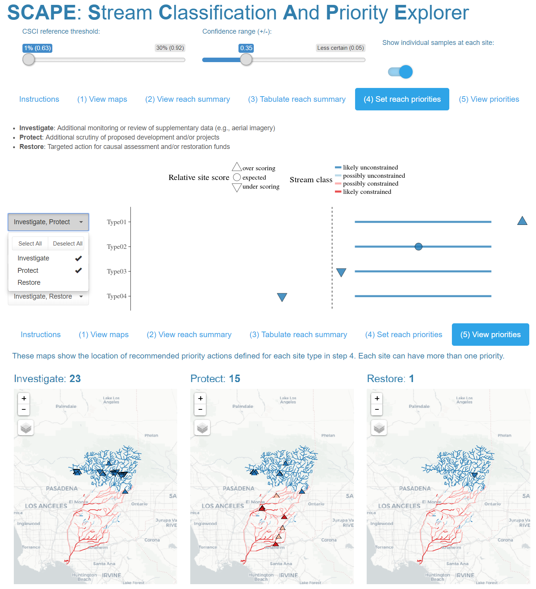

```{r setup, echo = F, warning = F, message = F, results = 'hide'}
# figure path, chunk options
knitr::opts_chunk$set(fig.path = 'figs/', warning = F, message = F, echo = F, cache = T, dev.args = list(family = 'serif'), dpi = 300, warning = F, out.width = '100%', cache.path = 'manu_draft_cache/',
  fig.process = function(x) {
  x2 = sub('-\\d+([.][a-z]+)$', '\\1', x)
  if (file.rename(x, x2)) x2 else x
  })

# libraries
library(tidyverse)
library(Hmisc)
library(Jabbrev)
library(gridExtra)
library(sf)
library(maptools)
library(maps)
library(grid)
library(ggrepel)
library(RColorBrewer)
library(ggridges)
library(scales)
library(quantregForest)
library(leaflet)
library(raster)
library(flextable)
library(officer)

# functions (incl. color palettes)
source('../R/funcs.R')

# extract bib entries from online
# bib_scrp('supplement.Rmd', 'refs_supp.bib')

# data
load(file = '../data/csci_raw.RData')
load(file = '../data/ludat.RData')
load(file = '../data/calipsa.RData')
load(file = '../data/psalab.RData')
load(file = '../data/rf_core.RData')
load(file = '../data/sgrlu.RData')
load(file = '../data/shed.RData')
load(file = '../data/spat.RData')
load(file = '../data/scrs.RData')
load(file = '../data/csci_comid.RData')
load(file = '../data/nhdplo.RData')
load(file = '../data/caliclsplo.RData')
load(file = '../data/calicls.RData')
load(file = '../data/caliexp.RData')
load(file = '../data/comid_prd.RData')
load(file = '../data/strclslen.RData')
load(file = '../data/sensres.RData')
load(file = '../data/typscrs.RData')
load(file = '../data/sgrclslen.RData')
```

# Supplement

<!-- supp figures -->
<!-- pritem - S1 -->
<!-- app - S2 -->
<!-- perflu - S3 -->

<!-- manu figures -->
<!-- calimap - 1 -->
<!-- ridges - 2 -->
<!-- sgrshd - 3 -->
<!-- calires - 4 -->
<!-- sensplo - 5 -->
<!-- sgrresplo - 6 -->
<!-- sgrresmap - 7 -->
<!-- tecolote - 8 -->

<!-- supp tables -->
<!-- none -->

<!-- manu tables -->
<!-- crvr - 1 -->
<!-- clsdef - 2 -->
<!-- pridsc - 3 -->
<!-- perftab - 4 -->
<!-- clstot - 5 -->
<!-- reltot - 6 -->

```{r pritem, fig.height = 4.75, fig.width = 7, fig.cap = 'Template provided to stakeholders for prioritization of recommended actions for each stream type.  The site types relate to the stream class for the biological expectation (likely unconstrained, possibly unconstrained, possibly constrained, likely constrained), relative site score for the observed CSCI (over-scoring, expected, under-scoring), and location of the score relative to a hypothetical biological threshold (dashed line, above or below).  Horizontal lines are the ranges of expected CSCI scores for a site with tick marks for the median. Priority actions defined by stakeholders are shown on the right for each stream type (text descriptions in Table 3). Actions are generalized as investigate, protect, or monitor as high (H), medium (M), or low (L) priority.  Blank cells indicate that no additional measures are recommended beyond the baseline monitoring and maintenance practiced at all sites.'}
sts <- paste('Site', seq(1:16))

# example data, csci scores
scrs_ex <- data.frame(
  Site = factor(sts, levels = sts),
  csci = c(1.25, 0.98, 0.81, 0.68, 1.14, 0.87, 0.73, 0.58, 0.98, 0.83, 0.68, 0.5, 0.88, 0.76, 0.57, 0.39)
)

# example data, stream predictions
exps_ex <- data.frame(
  Site = factor(sts, levels = sts),
  minv = rep(c(0.84, 0.68, 0.58, 0.43), each = 4),
  maxv = rep(c(1.14, 0.98, 0.88, 0.73), each = 4),
  stringsAsFactors = F
) %>% 
  mutate(medv = ((maxv - minv) / 2) + minv)

# calculate class, performance, type, 
plot_ex <- proc_all(exps_ex, scrs_ex, thrsh = 0.79, tails = 0.1) %>% 
  dplyr::rename(
    `Stream\nclass` = `Stream class`
  ) %>% 
  mutate(`Stream\nclass` = factor(`Stream\nclass`, levels = rev(levels(`Stream\nclass`))))

# priorities
pritab <- tibble(
  Type = seq(1:length(sts)),
  Investigate = c(rep(c('H', '', 'H', 'H'), 2), rep(c('M', 'M', '', 'M'), 2)),
  Protect = c(rep(c('H', 'M', 'M', ''), 2), rep(c('H', '', '', ''), 2)),
  Restore = c(rep(c('', '', 'M', 'H'), 2), rep(c('', 'L', 'L', 'L'), 2))
  ) %>% 
  gather('action', 'priority', -Type)

mythm <- theme_minimal(base_family = 'serif', base_size = 12) +
  theme(
    panel.grid.major = element_blank(), 
    panel.grid.minor = element_blank(), 
    axis.line.x = element_line(), 
    axis.line.y = element_line(), 
    axis.ticks.y = element_line(), 
    axis.text.x = element_blank(),
    legend.position = 'top',
    plot.margin = grid::unit(c(5.5, 0, 5.5, 5.5), units = 'pt')
  )

p1 <- ggplot(plot_ex, aes(x = typelv)) + 
  geom_errorbar(aes(ymin = minv_qt, ymax = maxv_qt, colour = `Stream\nclass`), width = 0, size = 2, alpha = 0.2) + 
  geom_errorbar(aes(ymin = minv_qt, ymax = maxv_qt, colour = `Stream\nclass`), width = 0, size = 2, alpha = 0.7) + 
  geom_point(aes(y = medv), colour = 'white', size = 0.75, alpha = 0.6, shape = 15) +
  geom_point(aes(y  = `CSCI score`, fill = `Stream\nclass`, shape = perf), size = 4, alpha = 0.8) +
  geom_hline(yintercept = 0.79, linetype = 'dashed') +
  scale_colour_manual('Stream segment class', values = pal_exp(levels(plot_ex$`Stream\nclass`)), 
                    guide = guide_legend(direction = 'vertical', title.position = 'left', ncol = 2)) +
  scale_fill_manual(values = pal_exp(levels(plot_ex$`Stream\nclass`)), 
                    guide = F) +
  scale_shape_manual('Relative site score', values = c(25, 21, 24)) +
  scale_x_discrete('Site type', limits = rev(levels(plot_ex$typelv)), labels = rev(c(1:nrow(plot_ex)))) +
  scale_y_continuous('CSCI score') +
  guides(colour = guide_legend(title.position = 'top', ncol = 2), shape = guide_legend(title.position = 'top')) + 
  mythm +
  coord_flip() + 
  ggtitle('')
p1leg <- g_legend(p1)
p1 <- p1 + mythm %+replace% theme(legend.position = 'none')

p2 <- ggplot(pritab, aes(x = Type, y = 1)) +
  geom_text(aes(label = priority), family = 'serif') + 
  facet_wrap(~action) + 
  coord_flip() + 
  scale_x_reverse(breaks = c(1:length(sts)), labels = c(1:length(sts))) + 
  theme(
    panel.background = element_rect(fill = NA),
    panel.grid.major = element_blank(),
    panel.grid.minor = element_blank(),
    strip.background = element_blank(),
    strip.text = element_text(family = 'serif', size = 11),
    axis.ticks.x = element_line(color = 'white'),
    axis.text.x = element_blank(),
    axis.ticks.y = element_blank(),
    axis.text.y = element_blank(), 
    # axis.text.y = element_text(family = 'serif', size = 12),
    axis.title = element_text(colour = 'white'), 
    plot.margin = grid::unit(c(4, 5.5, 5.5, -3), units = 'pt')
  )

grid.arrange(
  p1leg, 
  arrangeGrob(p1, p2, ncol = 2, widths = c(1, 0.8)), 
  heights = c(0.25, 1)
)
```

```{r app, fig.cap='Screenshots from the Stream Classification and Priority Explorer (SCAPE) tool used by the stakeholder group to interact with and use results from the landscape model.  The application allowed users to visualize results of segment classifications, relative site scores for the CSCI based on the expectation, and recommend management actions for each segment type.  The app is accessible at [http://shiny.sccwrp.org/scape/](http://shiny.sccwrp.org/scape/).'}

```

```{r perflu, fig.height =  6, fig.width = 6, fig.cap = "Model performance in relation to land cover and land cover by major regions in California. Model residuals (CSCI observed - predicted) were smaller in regions with more urban or agricultural land use (e.g., SC, CV) and larger in regions with less anthropogenic land use (e.g., SN, DM). CV: Central Valley, CH: Chaparral, DM: Deserts and Modoc Plateau, NC: North Coast, SN: Sierra Nevada, SC: South Coast."}

# observed and predicted data
obsdat <- csci_comid %>%
  dplyr::select(COMID, StationCode, SiteSet, SelectedSample, CSCI, PSA6c, PctImp2006Ws, TotUrb2011Ws, TotAg2011Ws) %>% 
  filter(SelectedSample %in% 'Selected')
prddat <- comid_prd %>% 
  dplyr::select(COMID, core0.50)

# combined data to eval for perf
dat <- obsdat %>% 
  inner_join(prddat, by = 'COMID') %>% 
  dplyr::rename(
    observed = CSCI,
    predicted = core0.50, 
    imperv = PctImp2006Ws, 
    ag = TotAg2011Ws,
    urb = TotUrb2011Ws,
    Region = PSA6c
  ) %>% 
  mutate(
    modrsd = observed - predicted
  ) %>%
  gather('var', 'val', urb, ag) %>% 
  mutate(var = factor(var, levels = c('urb', 'ag'), labels = c('Urban', 'Agriculture')))

col <- c('grey', 'lightsalmon')#RColorBrewer::brewer.pal(8, 'Paired')[c(1, 3)]

# residuals by land use
p1 <- ggplot(dat, aes(x = val, y = modrsd, colour = var)) +
  geom_point(size = 1, alpha = 0.7) +
  theme_bw(base_family = 'serif', base_size = 14) +
  facet_wrap(~var, strip.position = 'bottom', ncol = 2) +
  geom_hline(yintercept = 0) + 
  theme(
    strip.background = element_blank(), 
    strip.placement = 'outside', 
    axis.title.x = element_blank(), 
    legend.position = 'none'
  ) + 
  scale_y_continuous('CSCI observed - predicted', limits = c(-0.65, 0.65)) + 
  scale_colour_manual(values = col)

# land use by region
meds <- dat %>% 
  spread(var, val) %>% 
  group_by(Region) %>% 
  summarise(urbmed = median(log10(Urban), na.rm = T)) %>% 
  arrange(urbmed)

toplo <- dat %>% 
  mutate(Region = factor(Region, levels = meds$Region))
p2 <- ggplot(toplo, aes(x = Region, y = val, fill = var)) + 
  geom_boxplot() +
  scale_fill_manual(values = col) +
  scale_y_log10('% land cover, log10',
                breaks = scales::trans_breaks("log10", function(x) 10^x),
                labels = scales::trans_format("log10", scales::math_format(10^.x))
  ) +
  theme_bw(base_family = 'serif', base_size = 12) +
  theme(
    legend.position = 'top', 
    legend.title = element_blank(),
    axis.title.x = element_blank()
  )

grid.arrange(p1, p2, ncol = 1, heights = c(0.9, 1))
```

